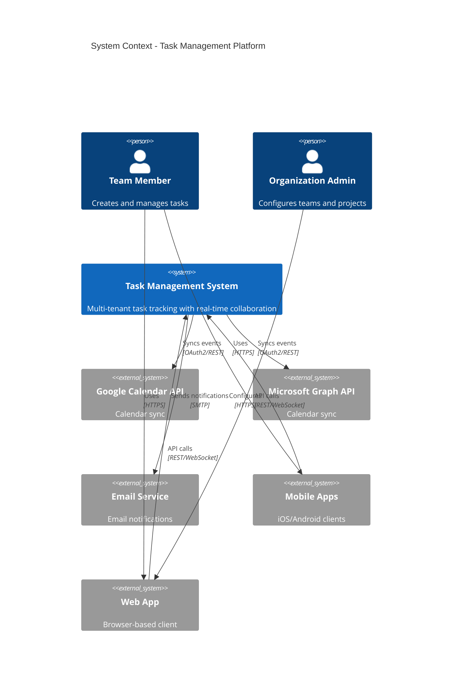
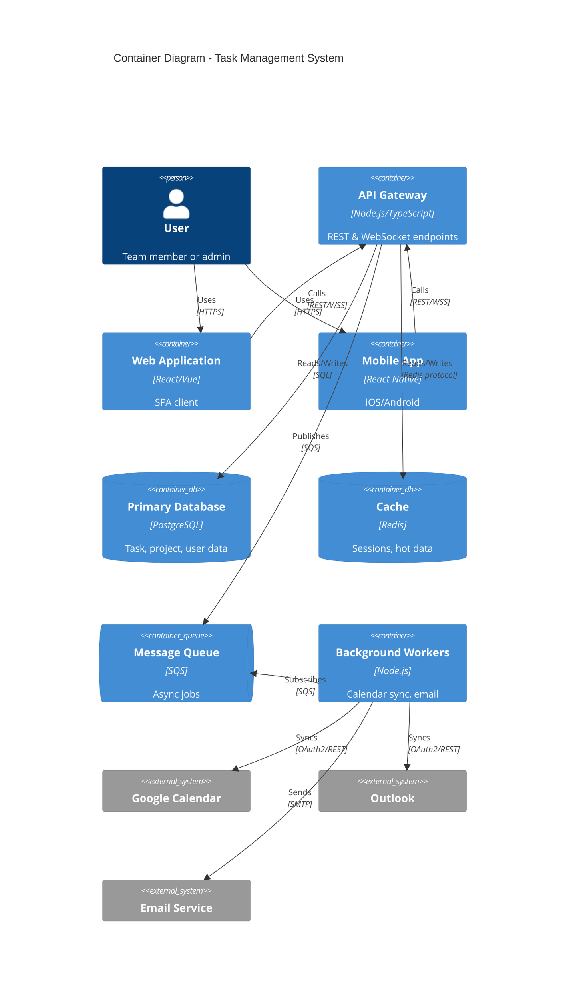
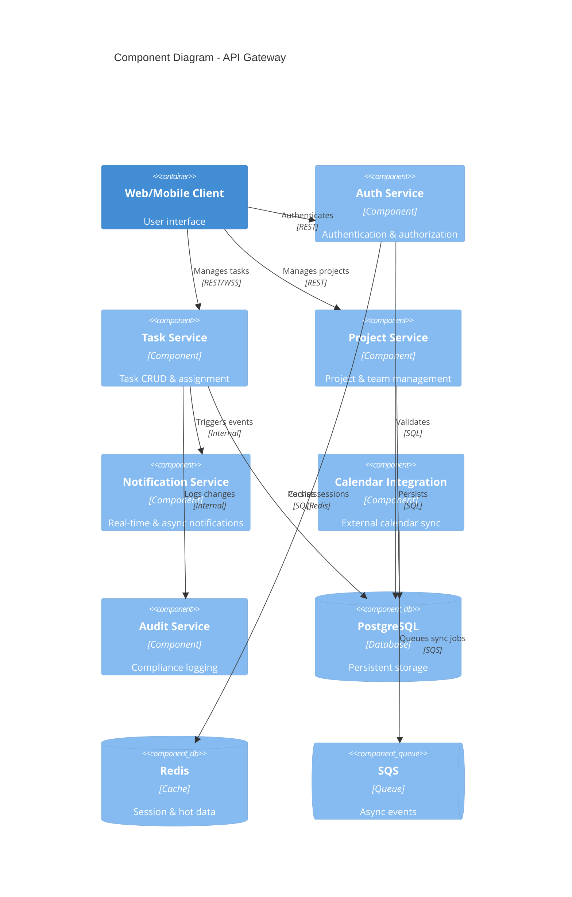
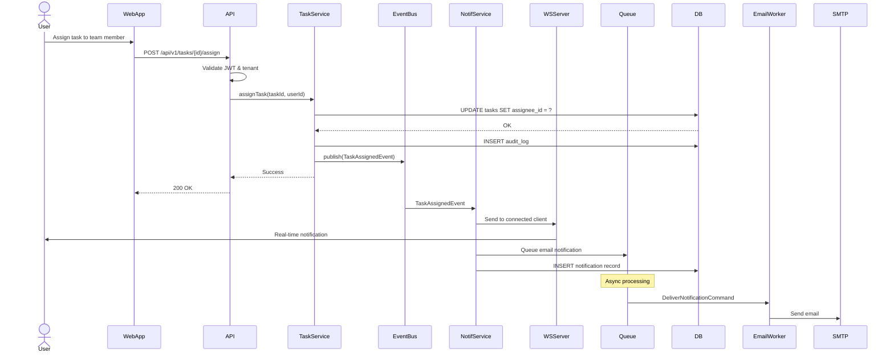
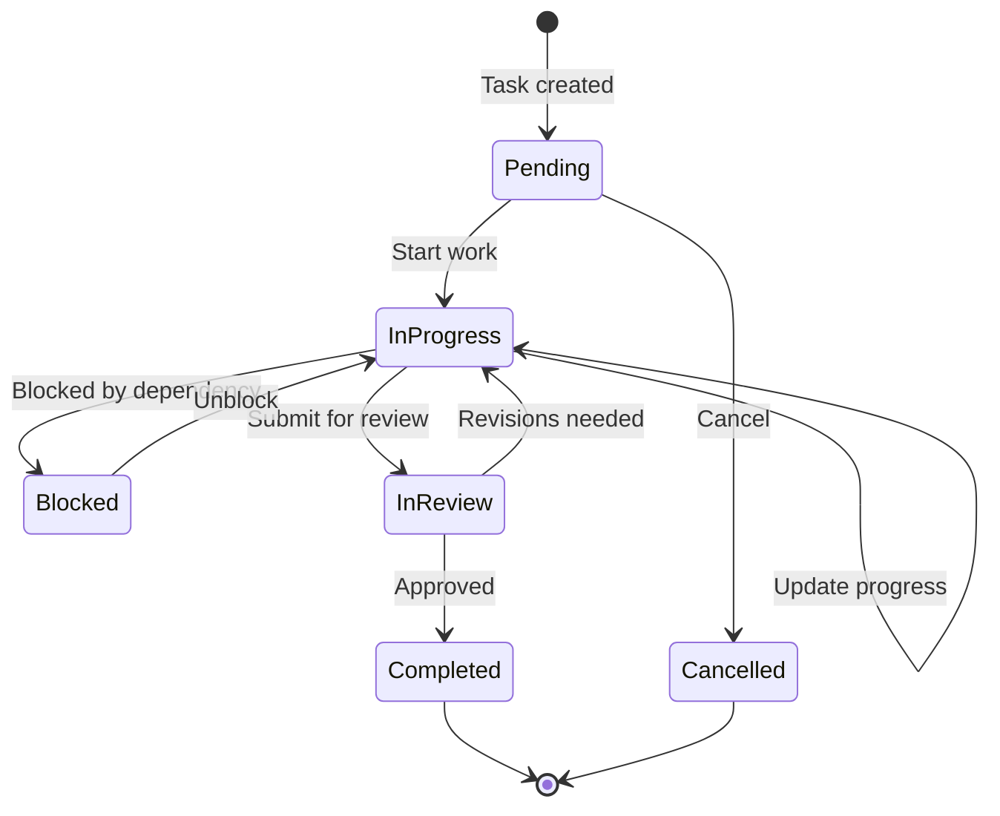
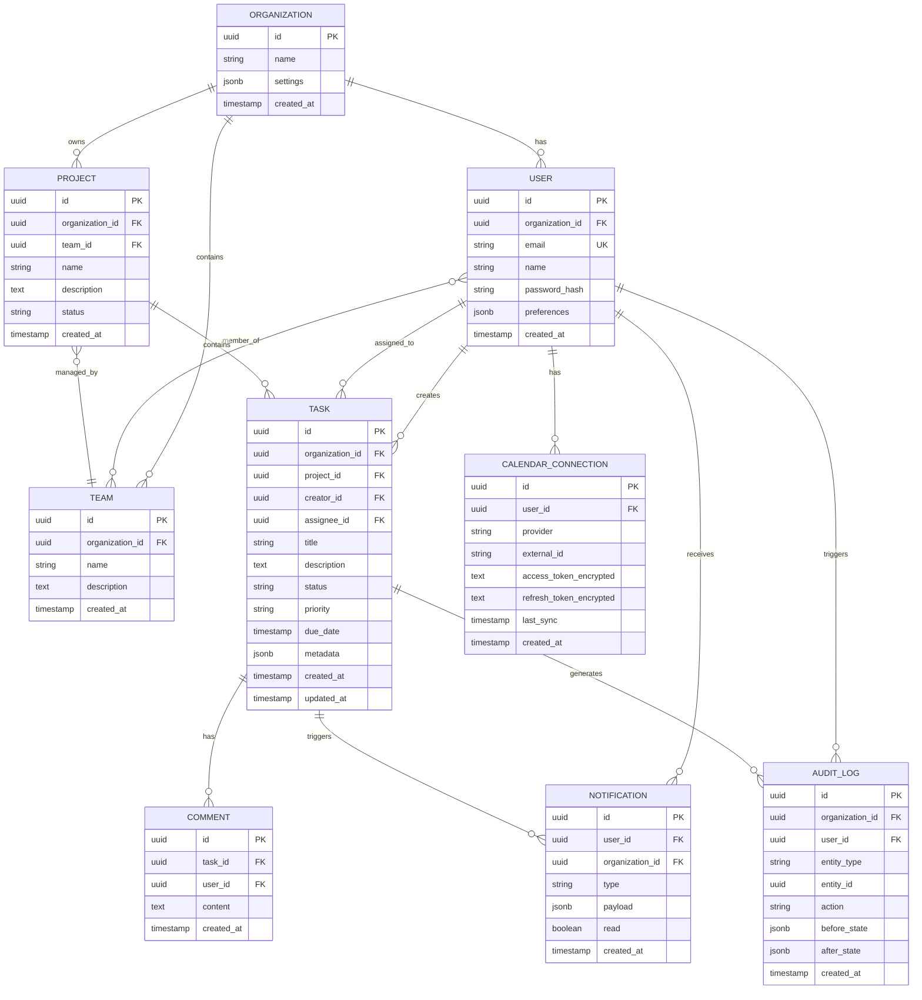

# Task Management System - Architecture Documentation

## 1. Introduction & Goals

### Business Goals
- Enable collaborative task management for distributed teams
- Provide real-time visibility into task status and assignments
- Integrate seamlessly with existing calendar workflows
- Support organizational multi-tenancy with data isolation

### Key Quality Goals
- **Scalability**: Support 10,000 concurrent users
- **Real-time**: Sub-second notification delivery
- **Reliability**: 99.9% uptime SLA
- **Security**: Multi-tenant data isolation, audit compliance
- **Maintainability**: Simple architecture for small team

### Stakeholders
- **End Users**: Team members creating and managing tasks
- **Team Leads**: Oversight of project progress
- **Admins**: Organization-level configuration
- **Development Team**: 3-5 developers maintaining the system
- **Compliance**: Audit trail requirements

## 2. Architecture Constraints

| Constraint | Impact |
| --- | --- |
| Small team (3-5 developers) | Favor simplicity over distributed complexity |
| 3-month MVP timeline | Modular monolith over microservices |
| AWS deployment | Leverage managed services (RDS, ElastiCache, SQS) |
| Budget conscious | Minimize infrastructure costs, use serverless where appropriate |
| Multi-tenancy required | Tenant isolation in data model and queries |
| External integrations | OAuth flows for Google Calendar and Outlook |
| Real-time notifications | WebSocket or SSE required |

## 3. Context & Scope

### System Context



### Business Context

| External Entity | Input | Output | Protocol |
| --- | --- | --- | --- |
| Web Client | User actions, WebSocket connections | Task data, real-time updates | HTTPS, WSS |
| Mobile Client | User actions, push tokens | Task data, notifications | HTTPS |
| Google Calendar | OAuth tokens, event data | Synced calendar entries | OAuth2/REST |
| Outlook Calendar | OAuth tokens, event data | Synced calendar entries | OAuth2/REST |
| Email Service | Notification requests | Delivered emails | SMTP/API |

## 4. Solution Strategy

### Architectural Approach
**Modular Monolith with Hexagonal Architecture** - Given team size and timeline constraints, we adopt a modular monolith with clear domain boundaries that can evolve into microservices if needed.

### Key Decisions
- **Hexagonal (Ports & Adapters)**: Clean separation between business logic and infrastructure
- **Vertical Slice per Feature**: Feature-focused organization within bounded contexts
- **Event-Driven Notifications**: Async event bus for decoupling notification delivery
- **Multi-Tenant Data Model**: Tenant ID in all entities with row-level security
- **API-First Design**: RESTful API with WebSocket for real-time features

### Technology Stack (Assumptions)
- **API Layer**: Node.js/TypeScript with Express or NestJS
- **Database**: PostgreSQL (RDS) with row-level security
- **Cache**: Redis (ElastiCache) for sessions and hot data
- **Message Queue**: AWS SQS for async processing
- **Real-time**: WebSocket (Socket.io or native WebSocket)
- **Deployment**: ECS Fargate or Lambda for cost optimization

## 5. Building Block View

### Level 1: System Decomposition



### Level 2: Component Diagram



### Bounded Contexts

| Context | Responsibility | Public Contracts |
| --- | --- | --- |
| **Identity & Access** | Multi-tenant user management, RBAC, JWT issuance | Auth API, token validation |
| **Task Management** | Task lifecycle, assignments, status transitions | Task CRUD API, task events |
| **Project Organization** | Projects, teams, hierarchies | Project API |
| **Notification Engine** | Real-time & async notifications | WebSocket API, notification events |
| **Calendar Integration** | External calendar sync (Google, Outlook) | Calendar API, sync events |
| **Audit & Compliance** | Immutable audit trail | Audit query API |

### API Draft

#### Identity & Access Service
| HTTP Method | Endpoint | Description |
| --- | --- | --- |
| POST | `/api/v1/auth/register` | Register new user account |
| POST | `/api/v1/auth/login` | Authenticate and receive JWT token |
| POST | `/api/v1/auth/refresh` | Refresh access token |
| GET | `/api/v1/users/me` | Get current user profile |
| PUT | `/api/v1/users/me` | Update current user profile |
| GET | `/api/v1/organizations/{orgId}/users` | List users in organization |
| POST | `/api/v1/organizations/{orgId}/invites` | Invite user to organization |

#### Task Management Service
| HTTP Method | Endpoint | Description |
| --- | --- | --- |
| POST | `/api/v1/tasks` | Create new task |
| GET | `/api/v1/tasks/{id}` | Fetch task details |
| PUT | `/api/v1/tasks/{id}` | Update task |
| DELETE | `/api/v1/tasks/{id}` | Delete task |
| GET | `/api/v1/tasks` | List tasks with filters (assignee, project, status) |
| POST | `/api/v1/tasks/{id}/assign` | Assign task to user |
| PUT | `/api/v1/tasks/{id}/status` | Update task status |
| POST | `/api/v1/tasks/{id}/comments` | Add comment to task |
| GET | `/api/v1/tasks/{id}/history` | Fetch task audit history |

#### Project Organization Service
| HTTP Method | Endpoint | Description |
| --- | --- | --- |
| POST | `/api/v1/projects` | Create new project |
| GET | `/api/v1/projects/{id}` | Fetch project details |
| PUT | `/api/v1/projects/{id}` | Update project |
| DELETE | `/api/v1/projects/{id}` | Archive project |
| GET | `/api/v1/projects` | List projects in organization |
| POST | `/api/v1/teams` | Create team |
| GET | `/api/v1/teams/{id}` | Fetch team details |
| POST | `/api/v1/teams/{id}/members` | Add team member |

#### Notification Service
| HTTP Method | Endpoint | Description |
| --- | --- | --- |
| WS | `/ws/notifications` | WebSocket connection for real-time updates |
| GET | `/api/v1/notifications` | List user notifications (paginated) |
| PUT | `/api/v1/notifications/{id}/read` | Mark notification as read |
| GET | `/api/v1/notifications/preferences` | Get notification preferences |
| PUT | `/api/v1/notifications/preferences` | Update notification preferences |

#### Calendar Integration Service
| HTTP Method | Endpoint | Description |
| --- | --- | --- |
| POST | `/api/v1/calendar/google/connect` | Initiate Google Calendar OAuth flow |
| POST | `/api/v1/calendar/google/callback` | Handle OAuth callback |
| POST | `/api/v1/calendar/outlook/connect` | Initiate Outlook OAuth flow |
| POST | `/api/v1/calendar/outlook/callback` | Handle OAuth callback |
| GET | `/api/v1/calendar/sync-status` | Check sync status |
| POST | `/api/v1/calendar/sync` | Trigger manual sync |
| DELETE | `/api/v1/calendar/disconnect` | Disconnect calendar integration |

#### Audit Service
| HTTP Method | Endpoint | Description |
| --- | --- | --- |
| GET | `/api/v1/audit/tasks/{id}` | Fetch audit trail for task |
| GET | `/api/v1/audit/export` | Export audit logs (admin only) |

### ASYNC API Draft

| Channel | Message Types | Payload Name | Purpose |
| --- | --- | --- | --- |
| `task.created` | event | `TaskCreatedEvent` | Notifies when new task is created; triggers notifications to assignees |
| `task.updated` | event | `TaskUpdatedEvent` | Notifies when task is modified; triggers real-time UI updates |
| `task.assigned` | event | `TaskAssignedEvent` | Notifies when task is assigned to user; triggers notification delivery |
| `task.status_changed` | event | `TaskStatusChangedEvent` | Notifies when task status transitions; triggers workflow rules |
| `task.comment_added` | event | `TaskCommentAddedEvent` | Notifies when comment is added; triggers notifications to watchers |
| `project.created` | event | `ProjectCreatedEvent` | Notifies when project is created |
| `calendar.sync_requested` | command | `CalendarSyncCommand` | Triggers async calendar sync job |
| `calendar.event_synced` | event | `CalendarEventSyncedEvent` | Notifies when calendar event is successfully synced |
| `notification.deliver` | command | `DeliverNotificationCommand` | Queues notification for async delivery (email, push) |
| `audit.log` | event | `AuditLogEvent` | Records immutable audit entry |

## 6. Runtime View

### Key Flow: Task Assignment with Real-Time Notification



## 7. Deployment View

### Deployment Architecture



### Deployment Topology (AWS)

```
┌─────────────────────────────────────────────────────────────┐
│                        AWS Cloud                            │
│                                                             │
│  ┌─────────────────────────────────────────────────────┐  │
│  │              Application Load Balancer              │  │
│  └────────────────────┬────────────────────────────────┘  │
│                       │                                    │
│  ┌────────────────────┴────────────────────────────────┐  │
│  │           ECS Fargate / Lambda                      │  │
│  │  ┌──────────────┐  ┌──────────────┐                │  │
│  │  │ API Container│  │ API Container│  (Auto-scaled)  │  │
│  │  └──────┬───────┘  └──────┬───────┘                │  │
│  └─────────┼──────────────────┼─────────────────────────┘  │
│            │                  │                            │
│  ┌─────────┴──────────────────┴─────────────────────────┐  │
│  │                  ElastiCache (Redis)                 │  │
│  └──────────────────────────────────────────────────────┘  │
│                                                             │
│  ┌──────────────────────────────────────────────────────┐  │
│  │            RDS PostgreSQL (Multi-AZ)                 │  │
│  └──────────────────────────────────────────────────────┘  │
│                                                             │
│  ┌──────────────────────────────────────────────────────┐  │
│  │                   SQS Queues                         │  │
│  │  - notification-queue                                │  │
│  │  - calendar-sync-queue                               │  │
│  └──────────────────────────────────────────────────────┘  │
│                                                             │
│  ┌──────────────────────────────────────────────────────┐  │
│  │         Lambda Workers (Event-driven)                │  │
│  │  - Calendar sync worker                              │  │
│  │  - Email notification worker                         │  │
│  └──────────────────────────────────────────────────────┘  │
│                                                             │
│  ┌──────────────────────────────────────────────────────┐  │
│  │              S3 (Static Assets, Backups)             │  │
│  └──────────────────────────────────────────────────────┘  │
│                                                             │
│  ┌──────────────────────────────────────────────────────┐  │
│  │        CloudWatch (Logs, Metrics, Alarms)            │  │
│  └──────────────────────────────────────────────────────┘  │
└─────────────────────────────────────────────────────────────┘
```

### Infrastructure Components
- **Compute**: ECS Fargate for API containers, Lambda for workers
- **Database**: RDS PostgreSQL Multi-AZ for HA
- **Cache**: ElastiCache Redis cluster
- **Queue**: SQS for async messaging
- **Storage**: S3 for file attachments and backups
- **Monitoring**: CloudWatch for logs, metrics, alarms
- **CDN**: CloudFront for static assets (web app)

### Entity-Relationship Diagram



## 8. Crosscutting Concepts

### Multi-Tenancy Strategy
- **Data Isolation**: Every table includes `organization_id` with row-level security policies
- **Query Filtering**: Application-level tenant context in all database queries
- **Connection Pooling**: Shared connection pool with tenant-scoped queries

### Authentication & Authorization
- **Authentication**: JWT-based with refresh tokens
- **Authorization**: RBAC with organization-scoped roles (admin, member, viewer)
- **Session Management**: Redis-based session storage for WebSocket connections

### Error Handling
- **API Errors**: Standardized error response format with error codes
- **Retry Logic**: Exponential backoff for external API calls
- **Circuit Breakers**: Prevent cascading failures in calendar integrations

### Logging & Observability
- **Structured Logging**: JSON logs with correlation IDs
- **Distributed Tracing**: Request tracing across async boundaries
- **Metrics**: Task creation rate, notification latency, WebSocket connections
- **Alerts**: Error rate threshold, database connection exhaustion, queue depth

### Caching Strategy
- **Session Cache**: User sessions and JWT validation
- **Query Cache**: Hot project/task data with TTL
- **Invalidation**: Event-driven cache invalidation on writes

### Security Practices
- **Input Validation**: Schema validation on all endpoints
- **SQL Injection Prevention**: Parameterized queries only
- **XSS Protection**: Content sanitization in comments
- **Rate Limiting**: Per-user and per-organization limits
- **Secrets Management**: AWS Secrets Manager for API keys

## 9. Architecture Decisions

See dedicated ADR files in `.spec/architecture/adrs/`:

- [ADR-0001: Modular Monolith vs Microservices](./adrs/adr-0001.md)
- [ADR-0002: WebSocket for Real-Time Notifications](./adrs/adr-0002.md)
- [ADR-0003: PostgreSQL with Row-Level Security for Multi-Tenancy](./adrs/adr-0003.md)
- [ADR-0004: SQS for Async Job Processing](./adrs/adr-0004.md)
- [ADR-0005: JWT Authentication with Redis Sessions](./adrs/adr-0005.md)

## 10. Quality Requirements

### Quality Attribute Scorecard

| Quality Attribute | Target | Measurement | Priority |
| --- | --- | --- | --- |
| **Scalability** | 10,000 concurrent users | Load testing, horizontal scaling validation | High |
| **Availability** | 99.9% uptime | Uptime monitoring, SLA tracking | High |
| **Performance** | < 200ms API response (p95) | APM tools, synthetic monitoring | High |
| **Real-Time Latency** | < 1s notification delivery | WebSocket latency metrics | High |
| **Security** | Zero tenant data leaks | Penetration testing, audit reviews | Critical |
| **Maintainability** | < 2 days for minor features | Team velocity tracking | Medium |
| **Cost Efficiency** | < $2000/month at 1K users | AWS cost explorer | Medium |
| **Data Integrity** | 100% audit log coverage | Audit completeness checks | High |

### Scenarios

**Scalability Scenario**
- **Stimulus**: User base grows from 1,000 to 10,000 concurrent users
- **Response**: System auto-scales ECS tasks and maintains <200ms p95 latency
- **Measure**: CloudWatch metrics confirm linear cost scaling

**Availability Scenario**
- **Stimulus**: Primary database failure
- **Response**: RDS Multi-AZ failover within 60 seconds
- **Measure**: Application resumes normal operation with <2 min downtime

**Security Scenario**
- **Stimulus**: Attempt to access another organization's tasks
- **Response**: Row-level security blocks unauthorized query
- **Measure**: Zero cross-tenant data leakage in penetration test

## 11. Risks & Technical Debt

### Risks

| Risk | Probability | Impact | Mitigation |
| --- | --- | --- | --- |
| External calendar API rate limits | Medium | High | Implement request queuing, exponential backoff, user-facing sync status |
| WebSocket connection scaling issues | Low | High | Use sticky sessions or Redis adapter for multi-instance WebSocket |
| Database query performance degradation | Medium | Medium | Index optimization, query monitoring, read replicas for reporting |
| OAuth token expiration handling | Medium | Medium | Implement robust refresh token flow with user notifications |
| Multi-tenant query bugs (data leakage) | Low | Critical | Comprehensive integration tests, row-level security validation |
| Budget overrun on AWS costs | Medium | Medium | Cost monitoring alerts, reserved instances for predictable workloads |

### Technical Debt

- **Monolith extraction path**: Document bounded context boundaries for future microservices split
- **Calendar sync reliability**: Implement webhook support (Google Pub/Sub, Outlook webhooks) to reduce polling
- **Offline support**: Mobile app currently requires connectivity; consider local-first architecture
- **Advanced search**: Current filtering limited; consider Elasticsearch for full-text search
- **Reporting**: Basic task lists only; need dedicated analytics/reporting service

### Follow-up Actions

1. **POC**: WebSocket scaling test with 1,000 concurrent connections
2. **Security Review**: External penetration test focused on multi-tenant isolation
3. **Load Testing**: Simulate 10,000 users with realistic task CRUD patterns
4. **Cost Modeling**: Refine AWS cost estimates based on infrastructure sizing
5. **Calendar Integration**: Test Google/Outlook OAuth flows in sandbox

## 12. Glossary

| Term | Definition |
| --- | --- |
| **Multi-tenancy** | Architecture pattern where single application instance serves multiple organizations with isolated data |
| **Bounded Context** | DDD concept defining clear boundaries around related domain models |
| **Row-Level Security (RLS)** | Database feature enforcing data access policies at the row level |
| **Circuit Breaker** | Resilience pattern preventing cascading failures by failing fast when downstream service is degraded |
| **Hexagonal Architecture** | Pattern separating core business logic from external dependencies via ports and adapters |
| **Vertical Slice** | Feature organization cutting across all layers (UI, API, data) for a single use case |
| **JWT** | JSON Web Token - stateless authentication token format |
| **WebSocket** | Protocol providing full-duplex communication over single TCP connection |
| **Event Sourcing** | Pattern storing state changes as sequence of events (not used here, but considered) |
| **CQRS** | Command Query Responsibility Segregation (not used here, but considered) |
| **Saga** | Pattern for managing distributed transactions across services |
| **SLA** | Service Level Agreement - commitment to availability/performance targets |
