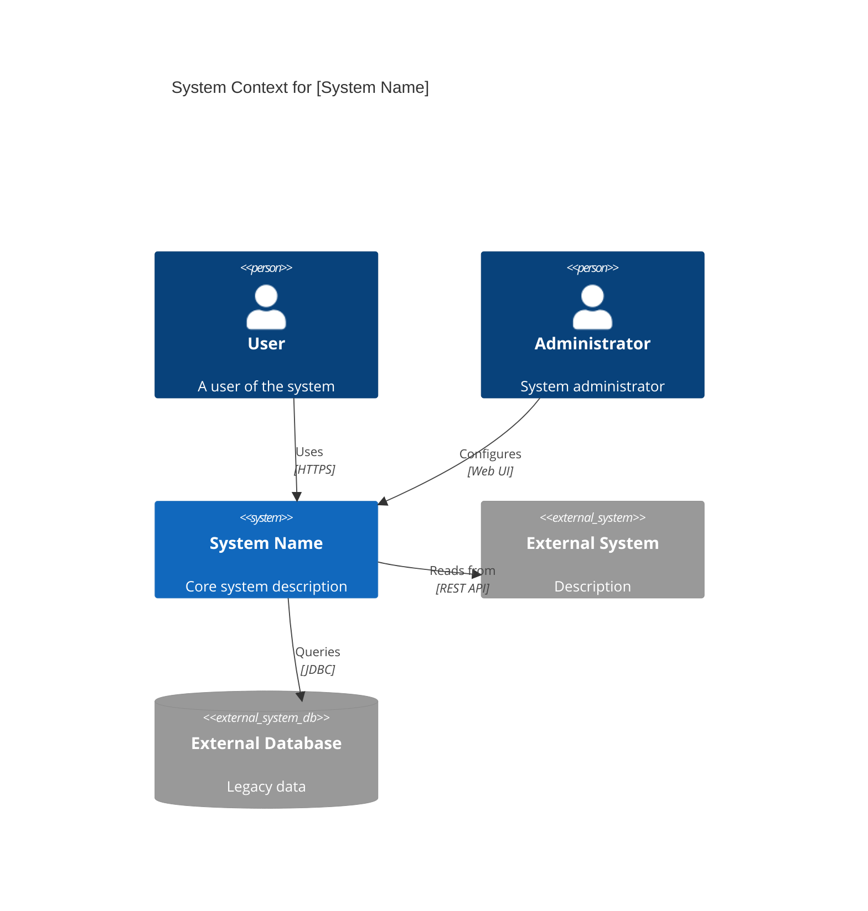
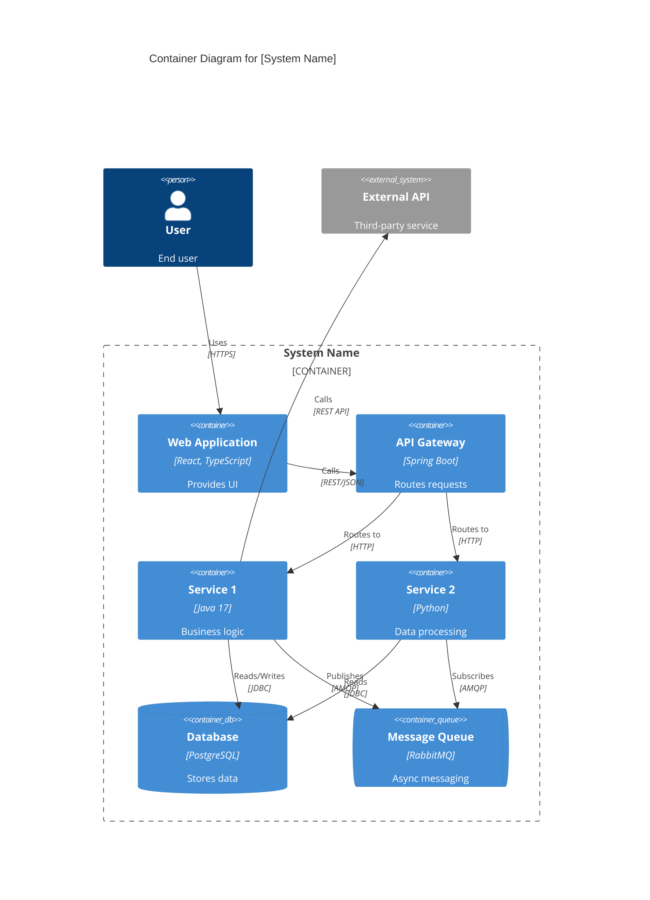
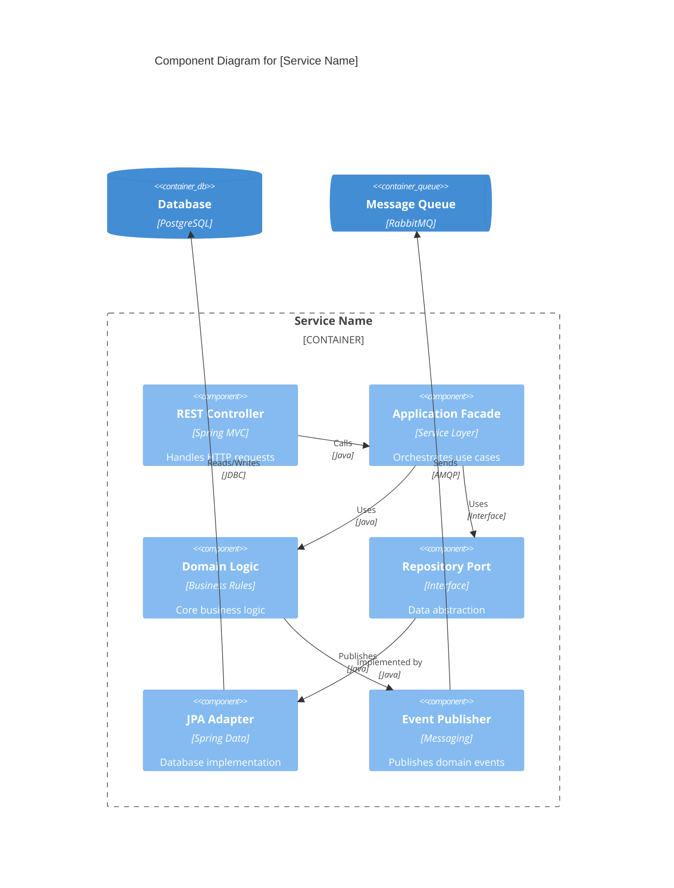
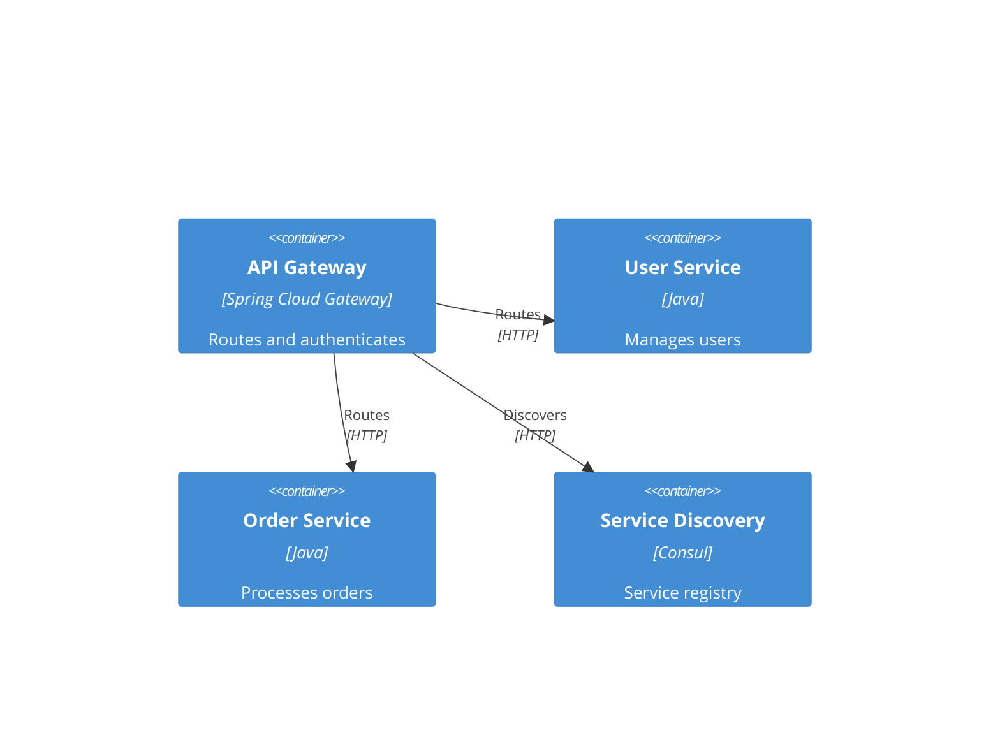
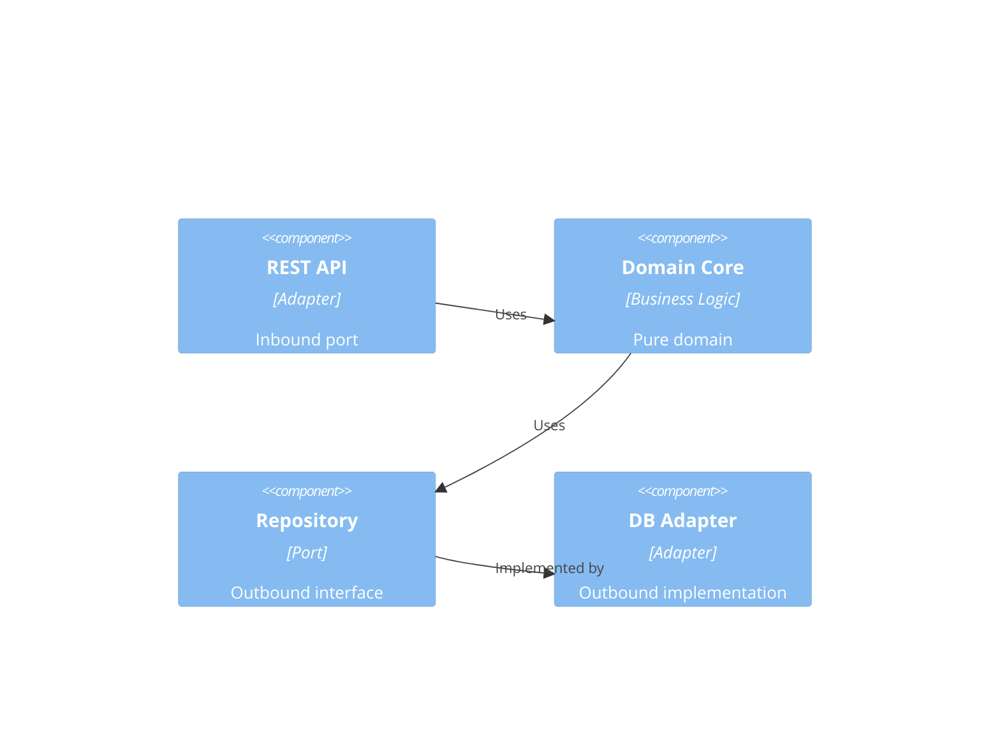
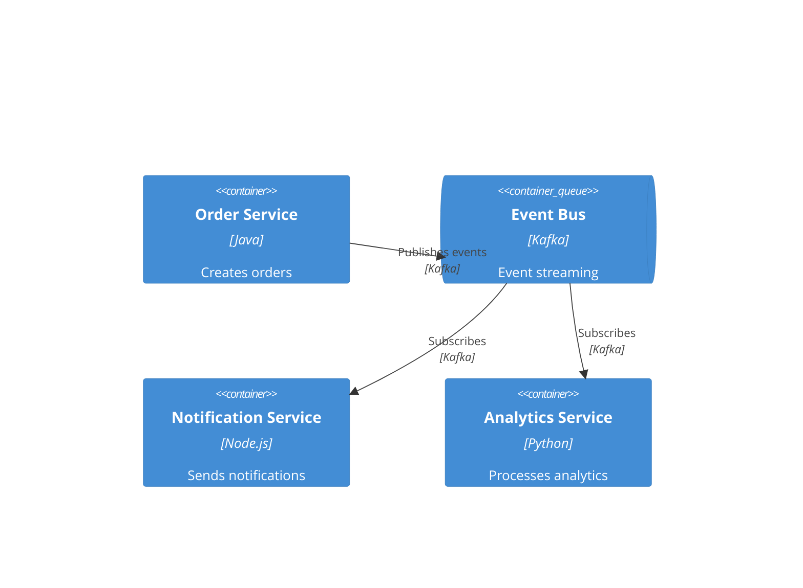

# C4 Diagram Skill

This skill generates C4 architecture diagrams using Mermaid C4 syntax. The C4 model provides a hierarchical way to visualize software architecture at different zoom levels.

## Purpose

Create clear, standardized architecture diagrams at three levels:
- **Context (Level 1):** System boundaries and external actors
- **Container (Level 2):** High-level technology choices and communication
- **Component (Level 3):** Internal structure of containers

## Instructions

When this skill is invoked:

1. **Determine diagram level:**
   - Ask which level: Context, Container, or Component
   - Or infer from user request context

2. **Gather required information:**
   - **Context:** System name, external actors, external systems, relationships
   - **Container:** Services/applications, databases, message brokers, communication protocols
   - **Component:** Internal modules, ports/adapters, data access layers, business logic

3. **Generate Mermaid C4 diagram:**
   - Use proper Mermaid C4 syntax
   - Include clear labels and relationships
   - Add descriptions for each element
   - Show protocols/technologies on relationships

4. **Provide context for placement:**
   - Context diagram → Section 3 of arc42
   - Container diagram → Section 5.2 of arc42
   - Component diagram → Section 5.3 of arc42

## C4 Diagram Templates

### Context Diagram (Level 1)



### Container Diagram (Level 2)



### Component Diagram (Level 3)



## C4 Element Types Reference

### Context Level
- `Person(id, label, description)` - Human actors
- `System(id, label, description)` - Your system
- `System_Ext(id, label, description)` - External systems
- `SystemDb_Ext(id, label, description)` - External databases

### Container Level
- `Container(id, label, technology, description)` - Application/service
- `ContainerDb(id, label, technology, description)` - Database
- `ContainerQueue(id, label, technology, description)` - Message queue
- `Container_Boundary(id, label)` - Group containers

### Component Level
- `Component(id, label, technology, description)` - Internal component
- `ComponentDb(id, label, technology, description)` - Component-level data
- `ComponentQueue(id, label, technology, description)` - Component-level messaging

### Relationships
- `Rel(from, to, label, technology)` - Standard relationship
- `Rel_Back(from, to, label, technology)` - Backward arrow
- `Rel_Neighbor(from, to, label, technology)` - Horizontal layout
- `Rel_R(from, to, label, technology)` - Right direction
- `Rel_L(from, to, label, technology)` - Left direction
- `Rel_U(from, to, label, technology)` - Up direction
- `Rel_D(from, to, label, technology)` - Down direction

## Usage Examples

**Example 1: Context diagram for e-commerce**
```
User: Create a context diagram for our e-commerce platform
Skill: [Generates C4Context with customer, admin, payment gateway, shipping provider]
```

**Example 2: Container diagram for microservices**
```
User: Show containers for order management system with 3 services
Skill: [Creates C4Container with order-service, payment-service, notification-service plus databases and message queue]
```

**Example 3: Component diagram for hexagonal architecture**
```
User: Component diagram showing hexagonal architecture of payment service
Skill: [Generates C4Component with ports, adapters, domain logic clearly separated]
```

## Best Practices

- **Use meaningful IDs:** Short, memorable identifiers (e.g., `orderSvc`, `userDb`)
- **Clear labels:** Concise names visible on diagram
- **Technology matters:** Always specify tech stack for containers/components
- **Describe purpose:** Each element should have a clear description
- **Show protocols:** Include communication protocols (HTTP, AMQP, JDBC)
- **Group logically:** Use boundaries to show system/service ownership
- **Consistent style:** Maintain same abstraction level within a diagram
- **Focus on structure:** Don't show runtime behavior (use sequence diagrams)

## Placement in arc42 Documentation

| Diagram Level | arc42 Section | Purpose |
|---------------|---------------|---------|
| Context | Section 3: Context & Scope | Show system boundaries and external dependencies |
| Container | Section 5.2: Building Block View (Level 2) | Show high-level service decomposition |
| Component | Section 5.3: Building Block View (Level 3) | Show internal component structure |

## Common Patterns

### Microservices with API Gateway


### Hexagonal Architecture Component


### Event-Driven System


## Error Handling

- If insufficient information: Ask specific questions about systems, actors, or technologies
- If user wants all three levels: Generate them in sequence (Context → Container → Component)
- If target section specified: Confirm placement in arc42 structure
- If Mermaid syntax errors: Validate element IDs, labels, and relationship syntax

## Output Format

Provide:
1. Complete Mermaid C4 diagram code block
2. Explanation of key elements and relationships
3. Recommended placement in documentation (arc42 section)
4. Suggestions for related diagrams if needed
