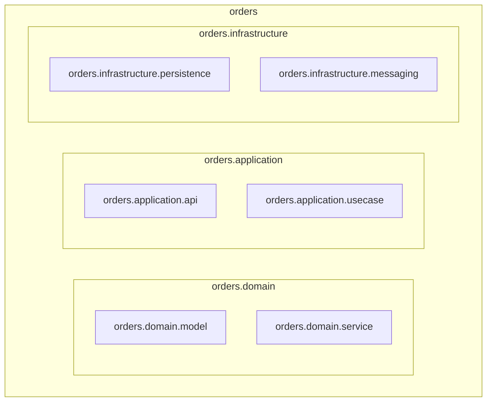
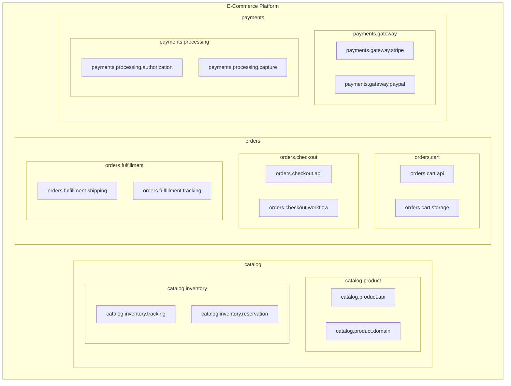
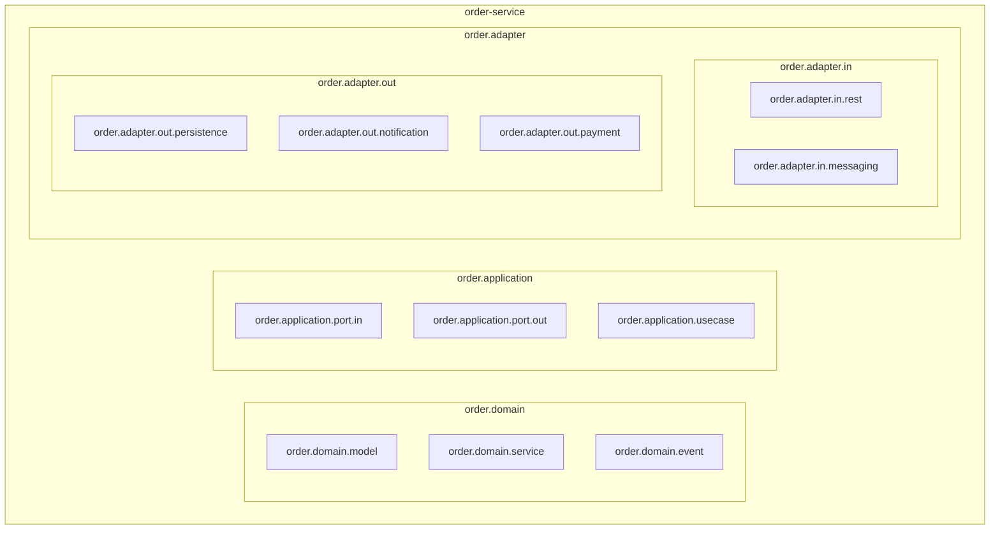
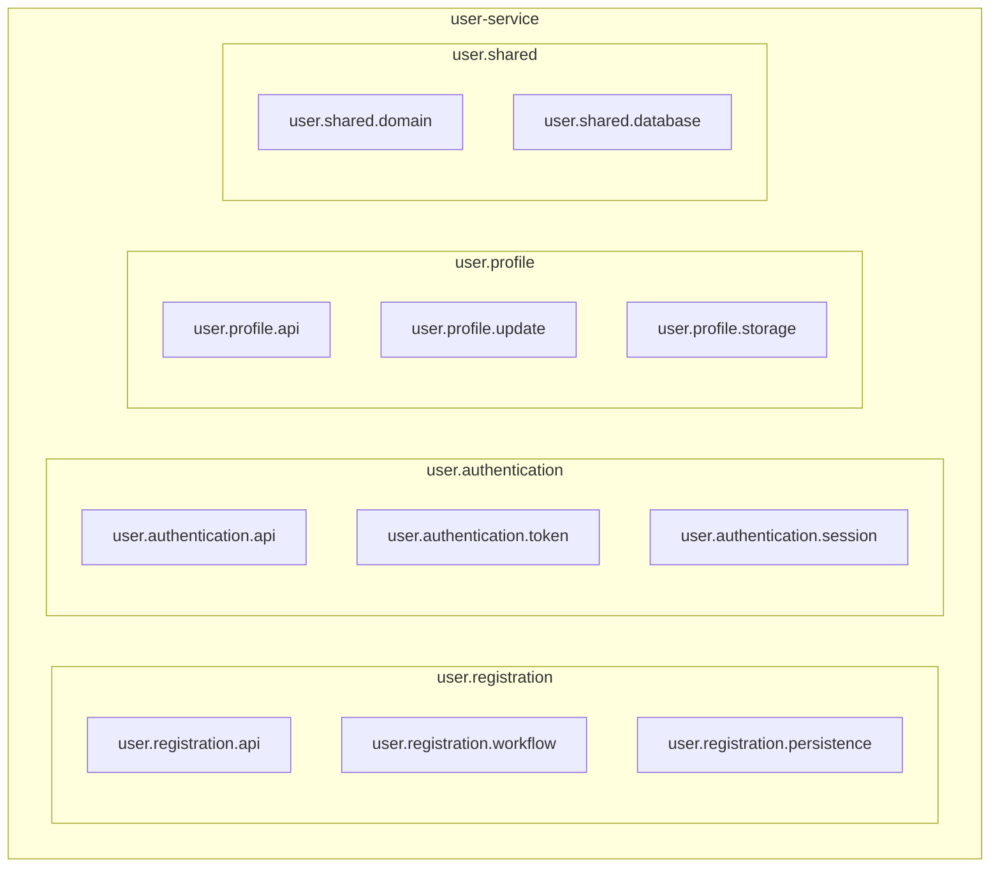
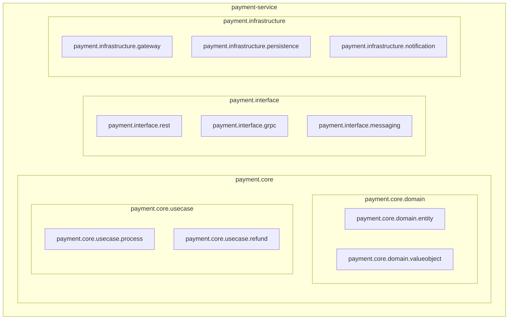
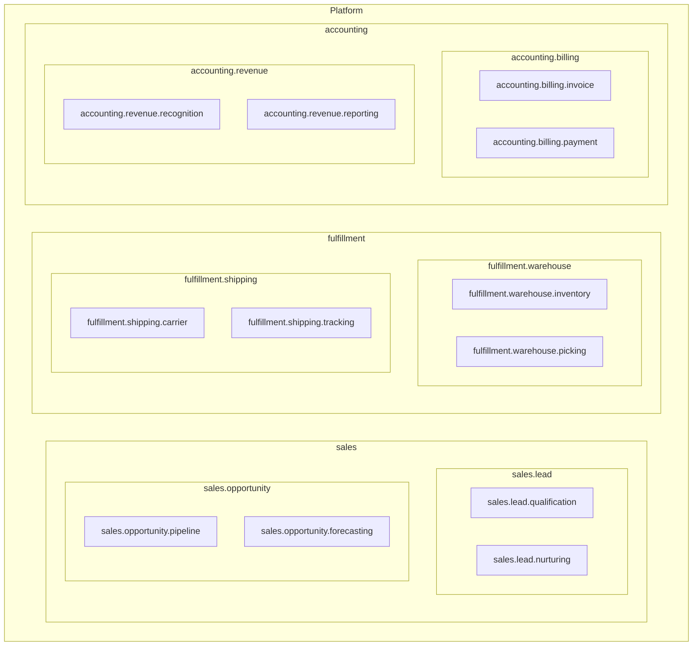
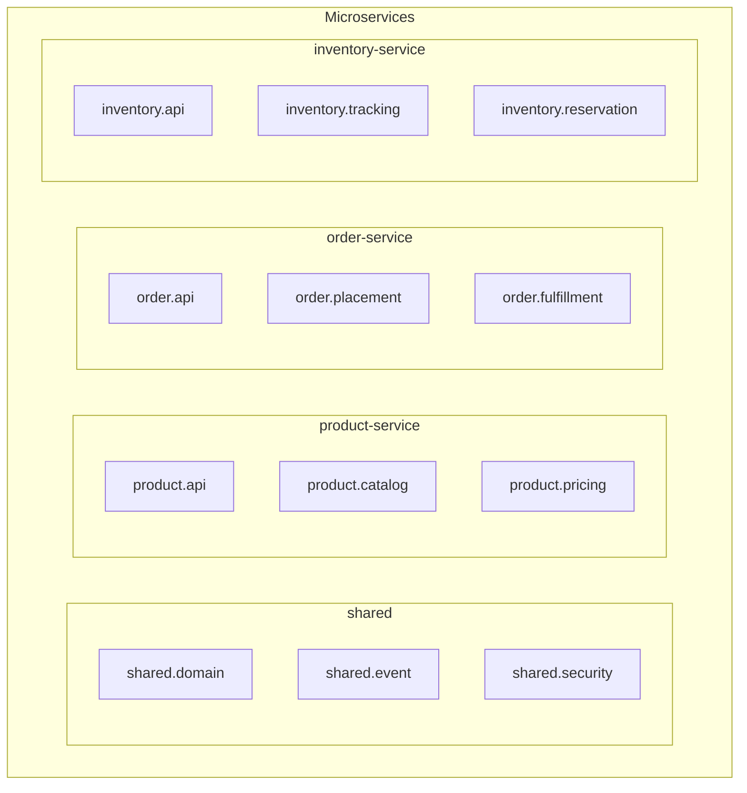
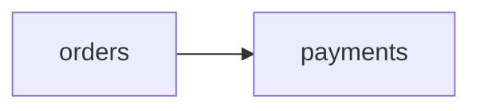
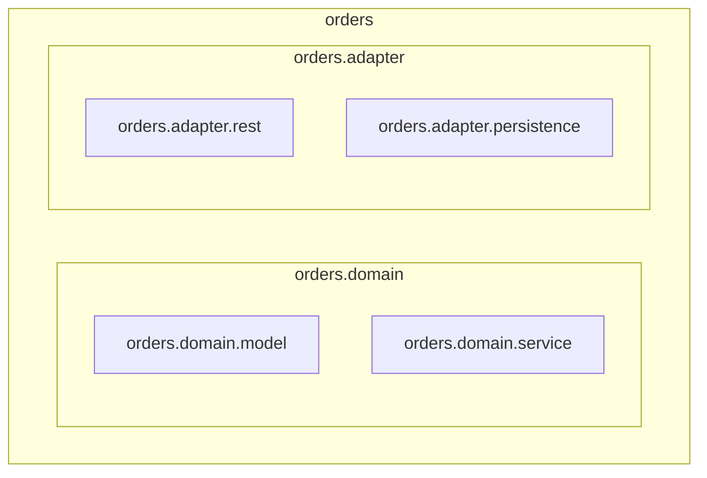

# Modules Hierarchy Diagram Skill

This skill generates hierarchical module and package structure diagrams using Mermaid flowcharts with nested `subgraph` blocks to visualize code organization, bounded contexts, and architectural layers.

## Purpose

Document code organization showing:
- **Package hierarchy:** Nested module/package structure (3-4 levels deep)
- **Bounded contexts:** DDD domain boundaries
- **Architectural layers:** Hexagonal ports/adapters, vertical slices, clean architecture
- **Module responsibilities:** What each package contains
- **Service decomposition:** Microservice internal structure

## Instructions

When this skill is invoked:

1. **Determine structure type:**
   - Monolith package structure
   - Microservice internal modules
   - Multi-service bounded contexts
   - Layered/hexagonal/vertical slice architecture

2. **Gather hierarchy information:**
   - Top-level domains or services
   - Sub-packages and modules
   - Layer boundaries (domain, application, infrastructure)
   - Naming conventions (lowercase dot notation)

3. **Generate Mermaid flowchart:**
   - Use nested `subgraph` blocks (no arrows!)
   - 3-4 levels deep for clarity
   - Lowercase names (e.g., `orders.payments.webhooks`)
   - Empty nodes as package placeholders

4. **Create description table:**
   - List each package with purpose
   - Use same lowercase identifiers
   - Brief, actionable descriptions

5. **Provide placement guidance:**
   - Section 5.2 or 5.3 (Building Block View - Modules subsection)

## Mermaid Flowchart Syntax

### Basic Nested Structure (No Arrows)



**Key Rules:**
- **No arrows:** Structure only, not dependencies
- **Lowercase names:** `orders.payments`, not `Orders.Payments`
- **3-4 levels:** Too shallow = not useful, too deep = overwhelming
- **Empty nodes:** Just package labels, no implementation details

### Multi-Service Bounded Contexts



## Common Architecture Patterns

### 1. Hexagonal Architecture (Ports & Adapters)



**Package Descriptions:**

| Package | Description |
|---------|-------------|
| `order.domain.model` | Core entities, value objects, aggregates |
| `order.domain.service` | Domain logic and business rules |
| `order.domain.event` | Domain events for state changes |
| `order.application.port.in` | Inbound port interfaces (use cases) |
| `order.application.port.out` | Outbound port interfaces (dependencies) |
| `order.application.usecase` | Use case implementations |
| `order.adapter.in.rest` | REST API controllers |
| `order.adapter.in.messaging` | Message queue consumers |
| `order.adapter.out.persistence` | Database adapters (JPA, MongoDB) |
| `order.adapter.out.notification` | Email/SMS notification adapters |
| `order.adapter.out.payment` | Payment gateway adapters |

### 2. Vertical Slice Architecture



**Package Descriptions:**

| Package | Description |
|---------|-------------|
| `user.registration.api` | Registration endpoints |
| `user.registration.workflow` | Sign-up and verification flow |
| `user.registration.persistence` | User creation data access |
| `user.authentication.api` | Login/logout endpoints |
| `user.authentication.token` | JWT generation and validation |
| `user.authentication.session` | Session management |
| `user.profile.api` | Profile CRUD endpoints |
| `user.profile.update` | Profile update logic |
| `user.profile.storage` | Profile data access |
| `user.shared.domain` | Shared user entities |
| `user.shared.database` | Database configuration |

### 3. Clean Architecture (Onion)



### 4. DDD Bounded Contexts



### 5. Microservices with Shared Kernel



## Module Description Tables

### Hexagonal Example

| Package | Responsibility |
|---------|----------------|
| `order.domain.model` | Order aggregate, OrderItem value object, status enum |
| `order.domain.service` | Order validation, pricing calculation, state transitions |
| `order.domain.event` | OrderCreated, OrderConfirmed, OrderShipped events |
| `order.application.port.in` | CreateOrderUseCase, CancelOrderUseCase interfaces |
| `order.application.port.out` | LoadOrderPort, SaveOrderPort, SendEmailPort interfaces |
| `order.application.usecase` | Use case implementations orchestrating domain logic |
| `order.adapter.in.rest` | Spring MVC controllers exposing REST endpoints |
| `order.adapter.in.messaging` | Kafka listeners for events from other services |
| `order.adapter.out.persistence` | JPA repositories implementing outbound ports |
| `order.adapter.out.notification` | Email service adapter for notifications |
| `order.adapter.out.payment` | Payment gateway integration adapter |

### DDD Bounded Context Example

| Package | Responsibility |
|---------|----------------|
| `sales.lead.qualification` | Lead scoring, qualification rules, contact validation |
| `sales.lead.nurturing` | Email campaigns, drip sequences, engagement tracking |
| `sales.opportunity.pipeline` | Deal stages, probability tracking, sales process |
| `sales.opportunity.forecasting` | Revenue projections, win/loss analysis, quotas |
| `fulfillment.warehouse.inventory` | Stock levels, SKU management, location tracking |
| `fulfillment.warehouse.picking` | Pick list generation, wave picking, batch processing |
| `fulfillment.shipping.carrier` | Carrier integrations (FedEx, UPS, USPS) |
| `fulfillment.shipping.tracking` | Shipment tracking, delivery confirmation, exceptions |
| `accounting.billing.invoice` | Invoice generation, line items, tax calculation |
| `accounting.billing.payment` | Payment processing, reconciliation, dunning |

## Best Practices

### Naming Conventions
- **Lowercase dot notation:** `orders.payments.stripe`
- **Plural for collections:** `orders`, `users`, `products`
- **Singular for concepts:** `authentication`, `authorization`
- **No abbreviations:** `inventory` not `inv`, `customer` not `cust`

### Depth Guidelines
- **Level 1:** Top-level service or bounded context
- **Level 2:** Major functional areas or layers
- **Level 3:** Specific modules or features
- **Level 4:** Sub-modules (use sparingly, avoid if possible)

### Structure Clarity
- **No arrows:** Dependency flow belongs in sequence or component diagrams
- **Consistent grouping:** Layer, feature, or domain - pick one strategy
- **Balanced hierarchy:** Similar depth across branches
- **Avoid orphans:** Every package has a clear parent

### Table Quality
- **Match diagram:** Use exact same lowercase identifiers
- **Be specific:** "User profile CRUD endpoints" not "Profile stuff"
- **Show contents:** What files/classes live here
- **Indicate patterns:** "JPA repositories", "REST controllers", "Event handlers"

## Placement in arc42 Documentation

| Context | Section | Purpose |
|---------|---------|---------|
| Service modules | 5.2 Building Block View (Modules subsection) | Internal package structure |
| Bounded contexts | 5.1 Building Block View (Level 1) | High-level domain decomposition |
| Layered architecture | 5.2 or 5.3 | Architectural layer breakdown |
| Feature slices | 5.3 Building Block View (Level 3) | Vertical slice organization |

## Usage Examples

**Example 1: Hexagonal microservice**
```
User: Show module structure for order service using hexagonal architecture
Skill: [Generates diagram with domain, application (ports), adapter layers]
```

**Example 2: DDD bounded contexts**
```
User: Diagram bounded contexts for e-commerce platform
Skill: [Creates diagram with catalog, orders, payments, fulfillment contexts]
```

**Example 3: Vertical slices**
```
User: Module structure for user service organized by feature slices
Skill: [Shows registration, authentication, profile slices with shared domain]
```

**Example 4: Monolith decomposition**
```
User: Current monolith package structure before microservices migration
Skill: [Documents existing module hierarchy for strangler pattern planning]
```

## Common Anti-Patterns to Avoid

### ❌ Including Arrows

**Why wrong:** Modules diagram shows structure, not dependencies

### ❌ Mixed Case Names
```mermaid
subgraph Orders.Payments
```
**Why wrong:** Convention is lowercase dot notation

### ❌ Too Flat (1-2 levels)
```mermaid
subgraph service
    api
    domain
    infra
end
```
**Why wrong:** Not enough detail to guide implementation

### ❌ Too Deep (5+ levels)
```mermaid
subgraph a.b.c.d.e.f
```
**Why wrong:** Overwhelming, hard to comprehend

### ✅ Correct Structure (3-4 levels, lowercase, no arrows)


## Error Handling

- If architecture style unclear: Ask whether hexagonal, layered, vertical slice, or DDD
- If depth too shallow: Suggest breaking into sub-modules
- If depth too deep: Recommend consolidating packages
- If naming inconsistent: Standardize to lowercase dot notation

## Output Format

Always provide:
1. Mermaid flowchart with nested subgraphs (no arrows)
2. Module description table with matching lowercase identifiers
3. Architecture style explanation (hexagonal, vertical slice, etc.)
4. Recommended placement in arc42 Section 5
5. Implementation guidance (what files go where)

## Cross-References

- **C4 Component diagrams (c4-diagram skill):** Show dependencies between modules
- **API documentation (api-draft skill):** APIs exposed by adapter packages
- **Sequence diagrams (sequence-diagram skill):** Show interaction across modules
- **ADRs (create-adr skill):** Document architectural style decisions
