# UML Sequence Diagram Skill

This skill generates UML sequence diagrams using Mermaid to document runtime behavior, interaction flows, and message exchanges between system components.

## Purpose

Visualize dynamic behavior showing:
- **Message flows:** How components interact over time
- **Order of operations:** Sequential and parallel execution
- **Participants:** Actors, services, databases, external systems
- **Control flow:** Loops, conditions, error handling
- **Timing:** Synchronous vs asynchronous communication

## Instructions

When this skill is invoked:

1. **Identify the scenario:**
   - Happy path (primary success flow)
   - Error/failure scenario (degraded mode, retries)
   - Alternative flows (conditional branches)
   - Background/async processing

2. **Gather participants:**
   - External actors (users, systems)
   - Services/components
   - Databases
   - Message queues
   - External APIs

3. **Map interaction flow:**
   - Request/response pairs
   - Async messages (fire-and-forget)
   - Database queries
   - Event publications
   - Error conditions

4. **Generate Mermaid sequence diagram:**
   - Use clear participant names
   - Show message labels with protocols
   - Include activations (lifelines)
   - Add notes for important details
   - Use alt/opt/loop for control flow

5. **Provide placement guidance:**
   - Section 6.1: Happy-path scenario
   - Section 6.2: Failure/degraded scenario
   - Section 6.3: Background/batch scenario

## Mermaid Sequence Diagram Syntax

### Basic Structure

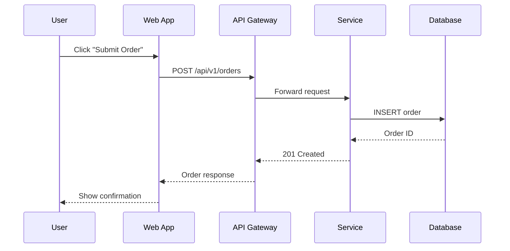

### Message Types

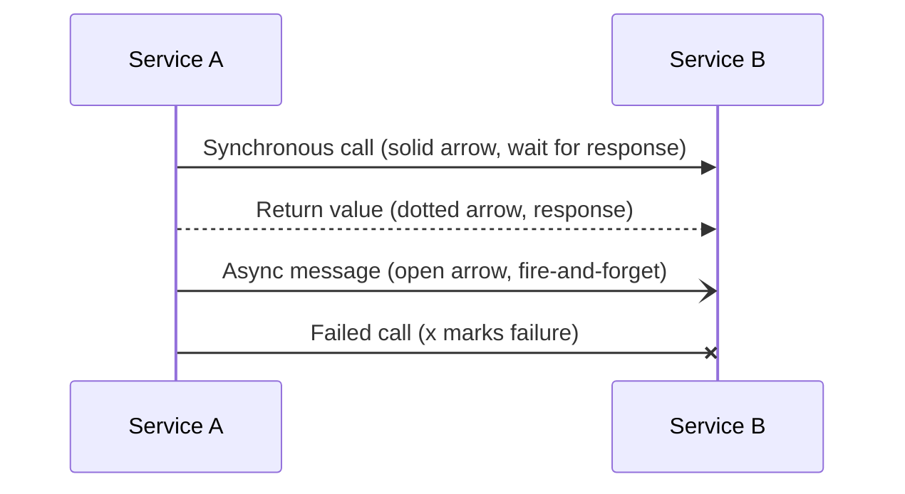

### Activations (Lifelines)

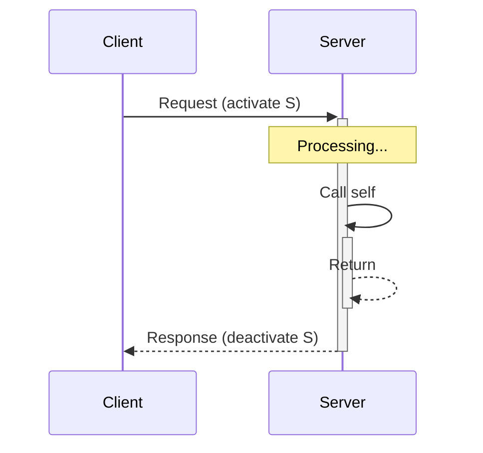

### Control Flow

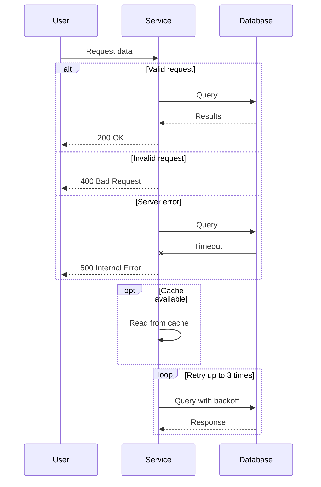

### Notes and Boxes

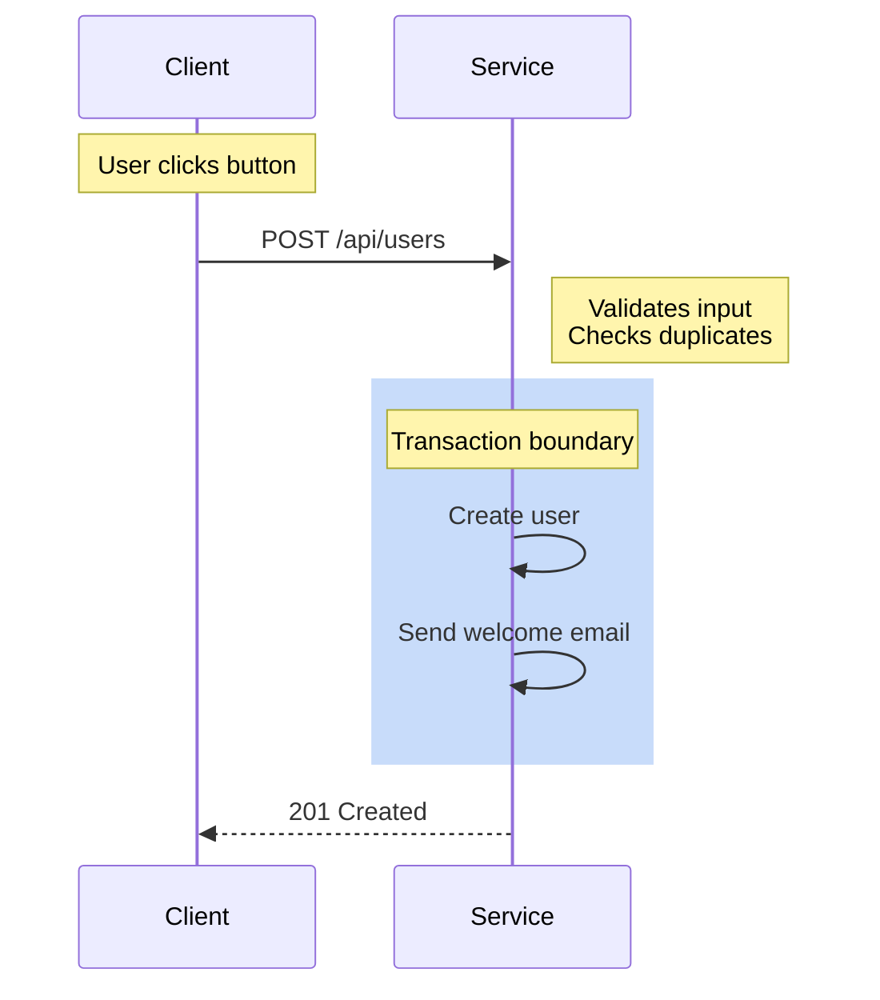

### Parallel Execution

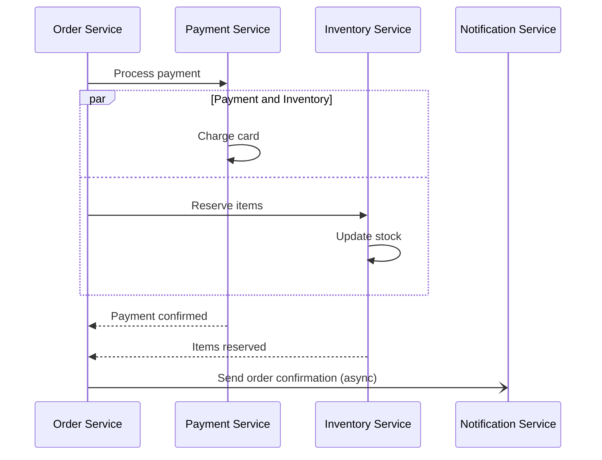

## Common Scenarios

### 1. Happy Path: Create Order

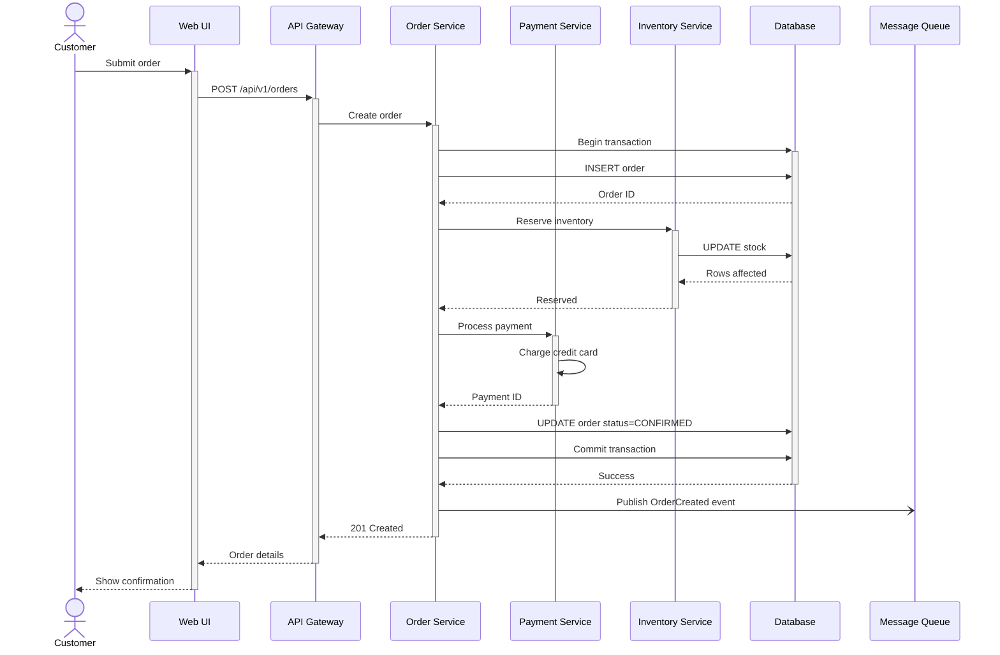

### 2. Error Scenario: Payment Failure

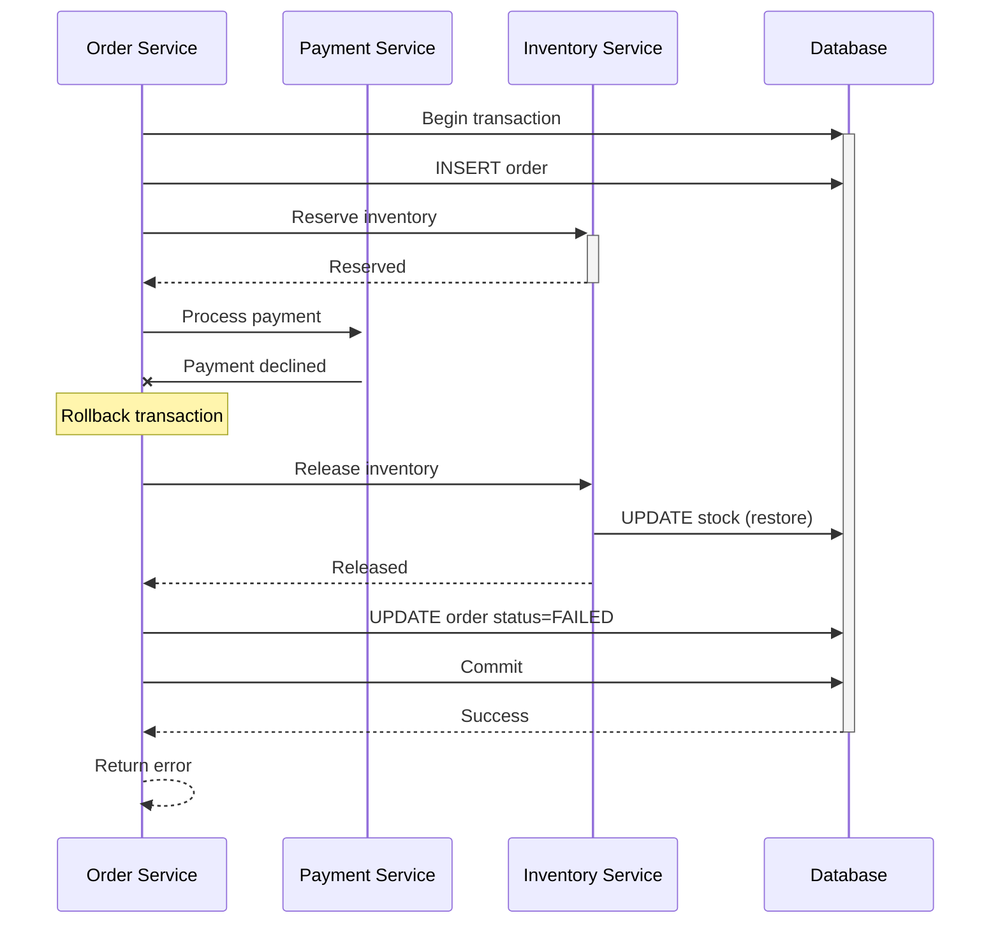

### 3. Async Processing: Background Job

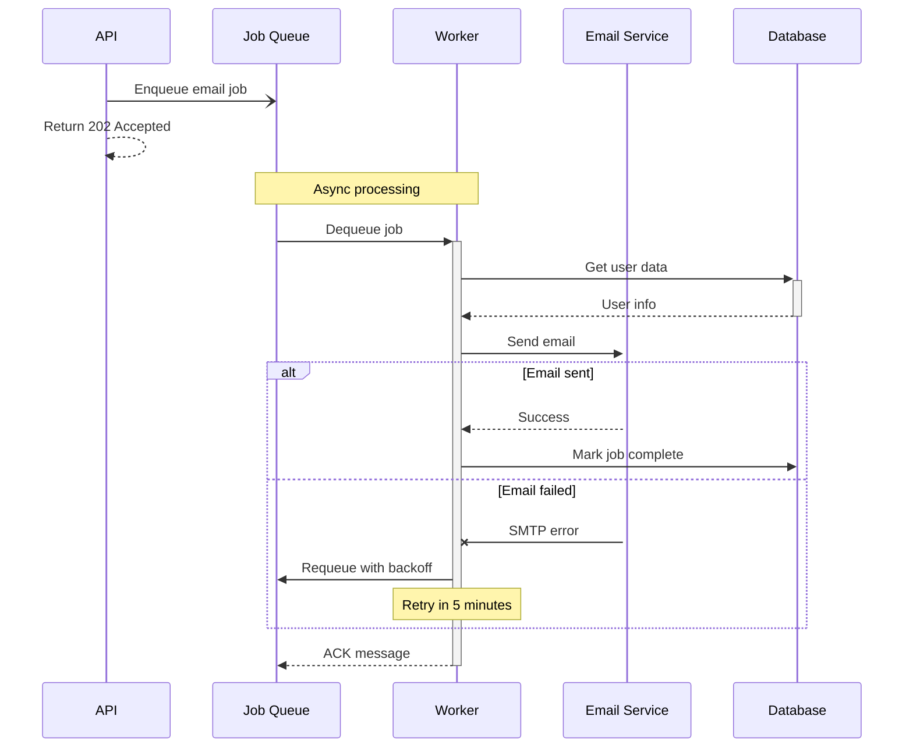

### 4. Saga Pattern: Distributed Transaction

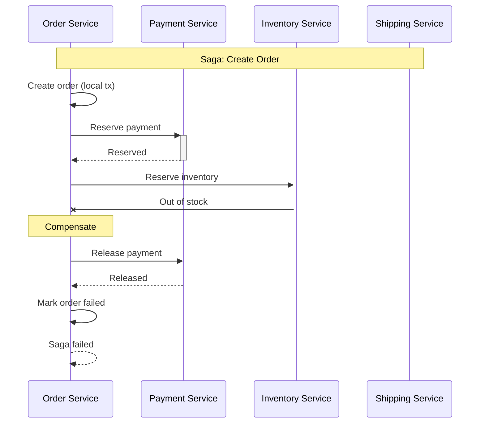

### 5. Circuit Breaker Pattern

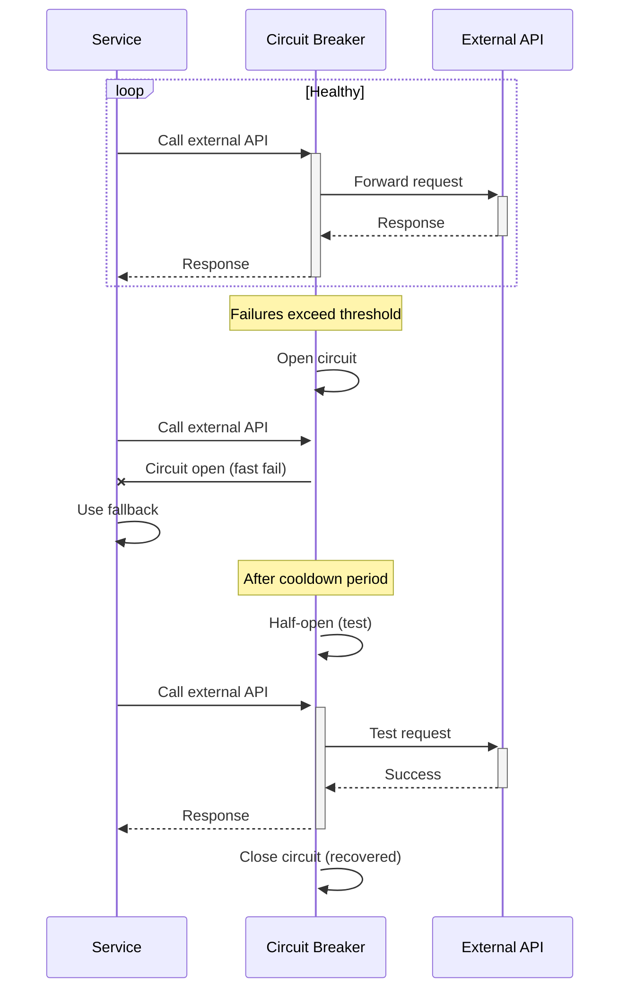

## Best Practices

### Participant Naming
- **Use aliases:** `participant U as User` for readability
- **Show types:** `actor`, `participant`, `database`
- **Consistent naming:** Match C4 diagram element names

### Message Labels
- **Be specific:** "POST /orders" not "Create"
- **Include protocols:** "HTTPS", "AMQP", "gRPC", "JDBC"
- **Show status codes:** "200 OK", "404 Not Found"

### Control Flow
- **alt/else:** For error handling and branches
- **opt:** For optional steps (caching, logging)
- **loop:** For retries and iterations
- **par:** For parallel/concurrent operations

### Clarity
- **Focus on one scenario:** Don't mix happy path with errors
- **Limit participants:** 5-7 max for readability
- **Add notes:** Explain non-obvious logic
- **Use boxes:** Group related operations (transactions, bounded contexts)

### Performance Indicators
- **Async calls:** Use `-)`for fire-and-forget
- **Activations:** Show processing time with `+`/`-`
- **Failures:** Mark with `x` to show errors

## Placement in arc42 Documentation

| Scenario Type | Section | Purpose |
|---------------|---------|---------|
| Happy path | 6.1 Happy-Path Scenario | Primary success flow |
| Error handling | 6.2 Failure/Degraded Scenario | Error recovery, retries, fallbacks |
| Background jobs | 6.3 Background/Batch Scenario | Async processing, scheduled tasks |
| Alternative flows | 6.1 or 6.2 | Conditional branches, variations |

## Usage Examples

**Example 1: REST API flow**
```
User: Sequence diagram for user registration with email verification
Skill: [Generates diagram showing API call, database insert, async email job]
```

**Example 2: Microservices orchestration**
```
User: Show order creation with payment, inventory, and shipping services
Skill: [Creates diagram with parallel calls, transaction coordination, event publishing]
```

**Example 3: Error handling with retry**
```
User: Diagram showing retry logic for external API call with circuit breaker
Skill: [Illustrates loop for retries, alt for success/failure, circuit breaker state]
```

**Example 4: Event-driven saga**
```
User: Saga pattern for distributed transaction with compensations
Skill: [Shows choreography with events, compensation flows for failures]
```

## Common Patterns

### Request-Response (Synchronous)
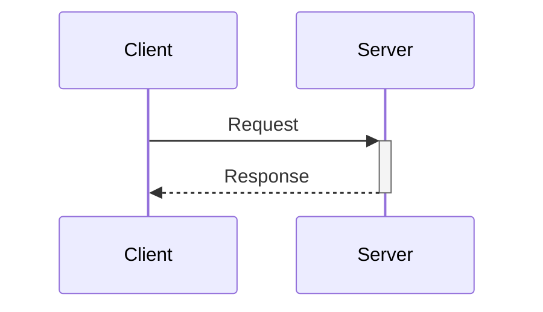

### Fire-and-Forget (Asynchronous)
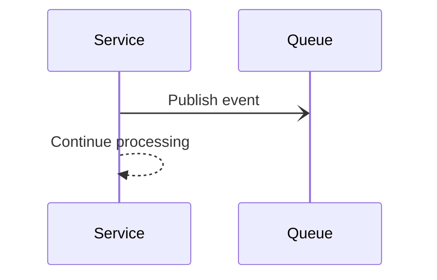

### Request-Reply with Queue
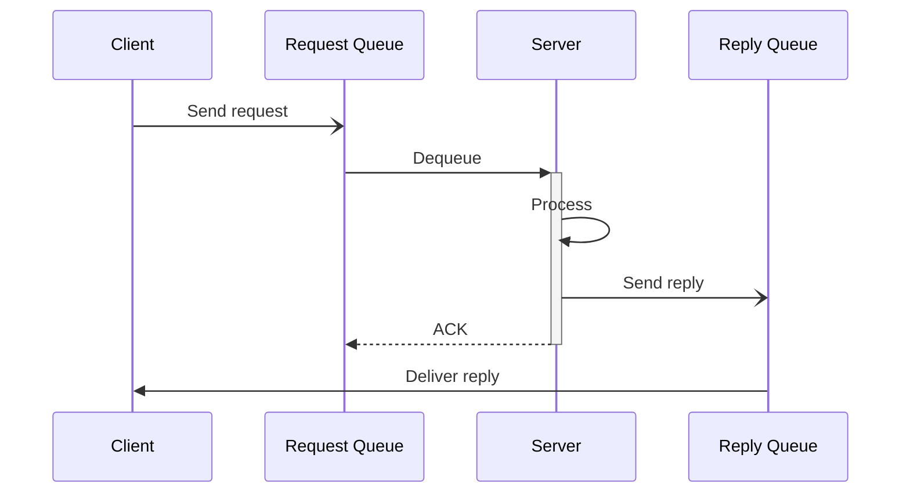

### Retry with Exponential Backoff
```mermaid
sequenceDiagram
    participant S as Service
    participant E as External API

    loop Retry up to 3 times
        S->>+E: Request
        alt Success
            E-->>-S: 200 OK
        else Failure
            E-x-S: Timeout
            Note over S: Wait 2^attempt seconds
        end
    end
```

## Error Handling

- If scenario unclear: Ask for specific flow (happy path, error, alternative)
- If participants unclear: Request list of systems/components involved
- If too complex: Suggest breaking into multiple diagrams
- If timing matters: Use notes to indicate durations or SLAs

## Output Format

Always provide:
1. Complete Mermaid sequence diagram code block
2. Scenario description (what flow is shown)
3. Key interactions explained
4. Error handling strategy (if applicable)
5. Recommended placement in arc42 Section 6
6. Related diagrams to consider (state diagram, C4 component)

## Cross-References

- **C4 diagrams (c4-diagram skill):** Sequence diagrams show runtime view of containers/components
- **State diagrams (state-diagram skill):** Complement with lifecycle state transitions
- **API documentation (api-draft skill):** Sequence diagrams illustrate API usage
- **ADRs (create-adr skill):** Document decisions about interaction patterns
