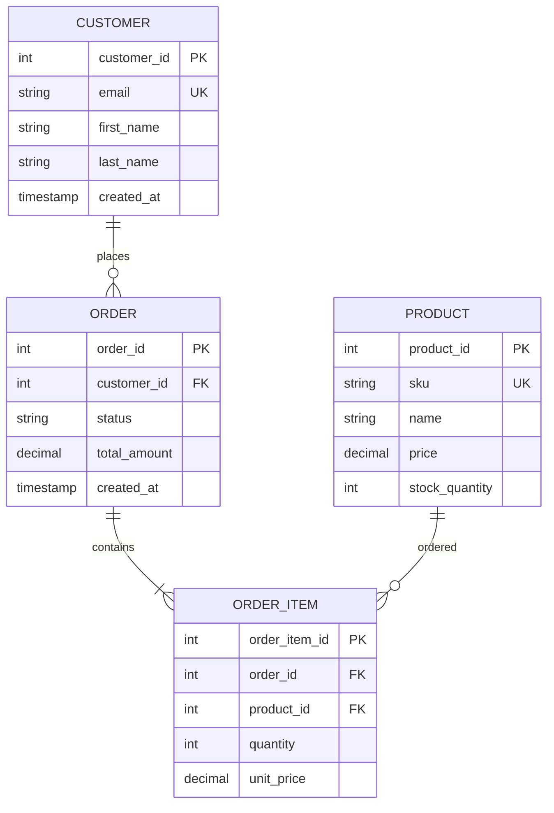

# SQL Schema Documentation Skill

This skill generates comprehensive relational database schema documentation using ER diagrams (Mermaid), DDL scripts, normalization analysis, indexing strategies, and constraint definitions.

## Purpose

Create clear, actionable SQL database schema documentation at two levels:
- **Level 1 (Domain/Conceptual):** High-level entity-relationship model
- **Level 2/3 (Technical/Implementation):** Detailed DDL with indexes, constraints, partitioning

## Instructions

When this skill is invoked:

1. **Determine documentation level:**
   - **Level 1:** For arc42 Section 8.1 (Domain & Data Concepts)
   - **Level 2/3:** For arc42 Section 5.3 (Components) or 7.2 (Infrastructure)

2. **Identify database platform:**
   - PostgreSQL (default if not specified)
   - MySQL / MariaDB
   - SQL Server
   - Oracle
   - Platform-agnostic (standard SQL)

3. **Gather schema information:**
   - Tables and their purposes
   - Columns with data types and constraints
   - Primary keys and foreign keys
   - Relationships and cardinality
   - Indexes for query optimization
   - Constraints (unique, check, default)
   - Partitioning strategy (if applicable)

4. **Generate appropriate documentation:**
   - Mermaid ER diagram for visual representation
   - DDL scripts for table creation
   - Index definitions with rationale
   - Constraint specifications
   - Normalization notes (1NF, 2NF, 3NF, BCNF)

5. **Provide placement guidance:**
   - Explain where to place in arc42 documentation
   - Suggest related documentation needs

## Schema Templates

### Level 1: Domain/Conceptual Model

For high-level understanding in Section 8.1:

#### Mermaid ER Diagram



**Notation:**
- `PK` - Primary Key
- `FK` - Foreign Key
- `UK` - Unique Key
- `||--o{` - One-to-many
- `||--||` - One-to-one
- `}o--o{` - Many-to-many

#### Relationship Descriptions

| Relationship | Cardinality | Description |
|--------------|-------------|-------------|
| CUSTOMER → ORDER | 1:N | A customer can place multiple orders |
| ORDER → ORDER_ITEM | 1:N | An order contains multiple line items |
| PRODUCT → ORDER_ITEM | 1:N | A product can appear in multiple orders |

### Level 2/3: Technical/Implementation Model

For detailed implementation in Section 5.3 or 7.2:

#### PostgreSQL DDL Example

```sql
-- Table: customers
-- Purpose: Store customer account information
CREATE TABLE customers (
    customer_id SERIAL PRIMARY KEY,
    email VARCHAR(255) NOT NULL UNIQUE,
    first_name VARCHAR(100) NOT NULL,
    last_name VARCHAR(100) NOT NULL,
    phone VARCHAR(20),
    created_at TIMESTAMP NOT NULL DEFAULT CURRENT_TIMESTAMP,
    updated_at TIMESTAMP NOT NULL DEFAULT CURRENT_TIMESTAMP,
    is_active BOOLEAN NOT NULL DEFAULT TRUE,

    CONSTRAINT email_format CHECK (email ~* '^[A-Za-z0-9._%+-]+@[A-Za-z0-9.-]+\.[A-Z|a-z]{2,}$')
);

-- Indexes
CREATE INDEX idx_customers_email ON customers(email);
CREATE INDEX idx_customers_active ON customers(is_active) WHERE is_active = TRUE;
CREATE INDEX idx_customers_created ON customers(created_at DESC);

-- Comments
COMMENT ON TABLE customers IS 'Customer account information';
COMMENT ON COLUMN customers.customer_id IS 'Unique customer identifier';
COMMENT ON COLUMN customers.email IS 'Customer email address (unique, used for login)';

-- Table: orders
-- Purpose: Store order headers
CREATE TABLE orders (
    order_id SERIAL PRIMARY KEY,
    customer_id INTEGER NOT NULL,
    order_number VARCHAR(50) NOT NULL UNIQUE,
    status VARCHAR(20) NOT NULL DEFAULT 'PENDING',
    subtotal NUMERIC(12, 2) NOT NULL,
    tax NUMERIC(12, 2) NOT NULL DEFAULT 0.00,
    shipping NUMERIC(12, 2) NOT NULL DEFAULT 0.00,
    total_amount NUMERIC(12, 2) NOT NULL,
    shipping_address JSONB,
    created_at TIMESTAMP NOT NULL DEFAULT CURRENT_TIMESTAMP,
    updated_at TIMESTAMP NOT NULL DEFAULT CURRENT_TIMESTAMP,

    CONSTRAINT fk_customer FOREIGN KEY (customer_id)
        REFERENCES customers(customer_id)
        ON DELETE RESTRICT
        ON UPDATE CASCADE,

    CONSTRAINT order_status_valid CHECK (status IN ('PENDING', 'CONFIRMED', 'SHIPPED', 'DELIVERED', 'CANCELLED')),
    CONSTRAINT total_calculation CHECK (total_amount = subtotal + tax + shipping),
    CONSTRAINT positive_amounts CHECK (subtotal >= 0 AND tax >= 0 AND shipping >= 0)
);

-- Indexes
CREATE UNIQUE INDEX idx_orders_number ON orders(order_number);
CREATE INDEX idx_orders_customer ON orders(customer_id, created_at DESC);
CREATE INDEX idx_orders_status ON orders(status, created_at DESC);
CREATE INDEX idx_orders_created ON orders(created_at DESC);
CREATE INDEX idx_orders_shipping_address ON orders USING GIN (shipping_address jsonb_path_ops);

-- Table: products
-- Purpose: Product catalog
CREATE TABLE products (
    product_id SERIAL PRIMARY KEY,
    sku VARCHAR(50) NOT NULL UNIQUE,
    name VARCHAR(255) NOT NULL,
    description TEXT,
    price NUMERIC(10, 2) NOT NULL,
    cost NUMERIC(10, 2),
    stock_quantity INTEGER NOT NULL DEFAULT 0,
    category VARCHAR(100),
    is_active BOOLEAN NOT NULL DEFAULT TRUE,
    created_at TIMESTAMP NOT NULL DEFAULT CURRENT_TIMESTAMP,
    updated_at TIMESTAMP NOT NULL DEFAULT CURRENT_TIMESTAMP,

    CONSTRAINT positive_price CHECK (price >= 0),
    CONSTRAINT positive_cost CHECK (cost IS NULL OR cost >= 0),
    CONSTRAINT non_negative_stock CHECK (stock_quantity >= 0)
);

-- Indexes
CREATE UNIQUE INDEX idx_products_sku ON products(sku);
CREATE INDEX idx_products_category ON products(category, is_active);
CREATE INDEX idx_products_active ON products(is_active) WHERE is_active = TRUE;
CREATE INDEX idx_products_name_search ON products USING GIN (to_tsvector('english', name));

-- Table: order_items
-- Purpose: Order line items (products in orders)
CREATE TABLE order_items (
    order_item_id SERIAL PRIMARY KEY,
    order_id INTEGER NOT NULL,
    product_id INTEGER NOT NULL,
    quantity INTEGER NOT NULL,
    unit_price NUMERIC(10, 2) NOT NULL,
    discount NUMERIC(10, 2) NOT NULL DEFAULT 0.00,
    line_total NUMERIC(12, 2) NOT NULL,

    CONSTRAINT fk_order FOREIGN KEY (order_id)
        REFERENCES orders(order_id)
        ON DELETE CASCADE
        ON UPDATE CASCADE,

    CONSTRAINT fk_product FOREIGN KEY (product_id)
        REFERENCES products(product_id)
        ON DELETE RESTRICT
        ON UPDATE CASCADE,

    CONSTRAINT positive_quantity CHECK (quantity > 0),
    CONSTRAINT positive_price CHECK (unit_price >= 0),
    CONSTRAINT valid_discount CHECK (discount >= 0 AND discount <= unit_price * quantity),
    CONSTRAINT line_total_calc CHECK (line_total = (unit_price * quantity) - discount)
);

-- Indexes
CREATE INDEX idx_order_items_order ON order_items(order_id);
CREATE INDEX idx_order_items_product ON order_items(product_id);

-- Trigger for updated_at timestamp
CREATE OR REPLACE FUNCTION update_updated_at_column()
RETURNS TRIGGER AS $$
BEGIN
    NEW.updated_at = CURRENT_TIMESTAMP;
    RETURN NEW;
END;
$$ LANGUAGE plpgsql;

CREATE TRIGGER update_customers_updated_at BEFORE UPDATE ON customers
    FOR EACH ROW EXECUTE FUNCTION update_updated_at_column();

CREATE TRIGGER update_orders_updated_at BEFORE UPDATE ON orders
    FOR EACH ROW EXECUTE FUNCTION update_updated_at_column();

CREATE TRIGGER update_products_updated_at BEFORE UPDATE ON products
    FOR EACH ROW EXECUTE FUNCTION update_updated_at_column();
```

#### Index Strategy Documentation

```markdown
### Indexing Strategy

**customers table:**
- `idx_customers_email` (B-tree): Fast lookup by email for login
- `idx_customers_active` (Partial): Only active customers, reduces index size
- `idx_customers_created` (B-tree DESC): Recent customers first

**orders table:**
- `idx_orders_number` (Unique B-tree): Order number lookup
- `idx_orders_customer` (Composite): Customer's orders sorted by date
- `idx_orders_status` (Composite): Orders by status and date
- `idx_orders_created` (B-tree DESC): Recent orders
- `idx_orders_shipping_address` (GIN): JSONB search on address fields

**products table:**
- `idx_products_sku` (Unique B-tree): SKU lookup
- `idx_products_category` (Composite): Active products by category
- `idx_products_active` (Partial): Only active products
- `idx_products_name_search` (GIN): Full-text search on product names

**order_items table:**
- `idx_order_items_order` (B-tree): Items by order
- `idx_order_items_product` (B-tree): Orders containing specific product
```

## Platform-Specific Features

### PostgreSQL

**Strengths:**
- Advanced data types (JSONB, arrays, hstore, UUID)
- Full-text search (tsvector, tsquery)
- Partial indexes for filtered subsets
- GIN/GiST indexes for complex types
- Table partitioning (range, list, hash)
- Powerful constraint system
- CTEs and window functions

**Example: JSONB Column**
```sql
CREATE TABLE events (
    event_id SERIAL PRIMARY KEY,
    event_type VARCHAR(50) NOT NULL,
    payload JSONB NOT NULL,
    created_at TIMESTAMP NOT NULL DEFAULT CURRENT_TIMESTAMP
);

CREATE INDEX idx_events_payload ON events USING GIN (payload jsonb_path_ops);

-- Query JSONB
SELECT * FROM events WHERE payload @> '{"user_id": 123}';
SELECT * FROM events WHERE payload->>'status' = 'completed';
```

**Example: Partitioning**
```sql
-- Partition by date range
CREATE TABLE orders_partitioned (
    order_id SERIAL,
    customer_id INTEGER NOT NULL,
    created_at TIMESTAMP NOT NULL,
    ...
) PARTITION BY RANGE (created_at);

CREATE TABLE orders_2025_q1 PARTITION OF orders_partitioned
    FOR VALUES FROM ('2025-01-01') TO ('2025-04-01');

CREATE TABLE orders_2025_q2 PARTITION OF orders_partitioned
    FOR VALUES FROM ('2025-04-01') TO ('2025-07-01');
```

### MySQL / MariaDB

**Strengths:**
- Storage engines (InnoDB, MyISAM)
- Replication and clustering
- JSON data type (MySQL 5.7+)
- Virtual/generated columns

**Example:**
```sql
CREATE TABLE customers (
    customer_id INT AUTO_INCREMENT PRIMARY KEY,
    email VARCHAR(255) NOT NULL UNIQUE,
    first_name VARCHAR(100) NOT NULL,
    last_name VARCHAR(100) NOT NULL,
    full_name VARCHAR(201) GENERATED ALWAYS AS (CONCAT(first_name, ' ', last_name)) STORED,
    created_at TIMESTAMP NOT NULL DEFAULT CURRENT_TIMESTAMP,
    updated_at TIMESTAMP NOT NULL DEFAULT CURRENT_TIMESTAMP ON UPDATE CURRENT_TIMESTAMP,

    KEY idx_email (email),
    KEY idx_full_name (full_name),
    KEY idx_created (created_at)
) ENGINE=InnoDB DEFAULT CHARSET=utf8mb4 COLLATE=utf8mb4_unicode_ci;
```

### SQL Server

**Strengths:**
- Columnstore indexes
- In-memory OLTP
- Temporal tables (system-versioned)
- Computed columns

**Example: Temporal Table**
```sql
CREATE TABLE customers (
    customer_id INT IDENTITY(1,1) PRIMARY KEY,
    email NVARCHAR(255) NOT NULL UNIQUE,
    first_name NVARCHAR(100) NOT NULL,
    last_name NVARCHAR(100) NOT NULL,
    created_at DATETIME2 NOT NULL DEFAULT SYSUTCDATETIME(),

    -- Temporal columns
    valid_from DATETIME2 GENERATED ALWAYS AS ROW START NOT NULL,
    valid_to DATETIME2 GENERATED ALWAYS AS ROW END NOT NULL,
    PERIOD FOR SYSTEM_TIME (valid_from, valid_to)
)
WITH (SYSTEM_VERSIONING = ON (HISTORY_TABLE = dbo.customers_history));
```

### Oracle

**Strengths:**
- Advanced partitioning
- Materialized views
- Virtual columns
- Global temporary tables

**Example:**
```sql
CREATE TABLE customers (
    customer_id NUMBER GENERATED ALWAYS AS IDENTITY PRIMARY KEY,
    email VARCHAR2(255) NOT NULL UNIQUE,
    first_name VARCHAR2(100) NOT NULL,
    last_name VARCHAR2(100) NOT NULL,
    full_name VARCHAR2(201) GENERATED ALWAYS AS (first_name || ' ' || last_name) VIRTUAL,
    created_at TIMESTAMP DEFAULT SYSTIMESTAMP NOT NULL,

    CONSTRAINT email_format CHECK (REGEXP_LIKE(email, '^[A-Za-z0-9._%+-]+@[A-Za-z0-9.-]+\.[A-Z|a-z]{2,}$'))
);

CREATE INDEX idx_customers_email ON customers(email);
CREATE INDEX idx_customers_full_name ON customers(full_name);
```

## Normalization Guidelines

### Normal Forms

**1NF (First Normal Form):**
- Atomic values (no arrays or lists in columns)
- Each column contains single value
- No repeating groups

**2NF (Second Normal Form):**
- Must be in 1NF
- No partial dependencies (all non-key attributes depend on entire primary key)

**3NF (Third Normal Form):**
- Must be in 2NF
- No transitive dependencies (non-key attributes depend only on primary key)

**BCNF (Boyce-Codd Normal Form):**
- Must be in 3NF
- Every determinant is a candidate key

### Normalization Example

**Denormalized (violates 2NF):**
```sql
CREATE TABLE orders_denormalized (
    order_id INT PRIMARY KEY,
    customer_id INT,
    customer_name VARCHAR(255),  -- ❌ Depends on customer_id, not order_id
    customer_email VARCHAR(255), -- ❌ Depends on customer_id, not order_id
    product_id INT,
    product_name VARCHAR(255),   -- ❌ Depends on product_id, not order_id
    quantity INT,
    order_date TIMESTAMP
);
```

**Normalized (3NF):**
```sql
CREATE TABLE customers (
    customer_id INT PRIMARY KEY,
    customer_name VARCHAR(255),
    customer_email VARCHAR(255)
);

CREATE TABLE products (
    product_id INT PRIMARY KEY,
    product_name VARCHAR(255),
    price NUMERIC(10, 2)
);

CREATE TABLE orders (
    order_id INT PRIMARY KEY,
    customer_id INT REFERENCES customers(customer_id),
    order_date TIMESTAMP
);

CREATE TABLE order_items (
    order_item_id INT PRIMARY KEY,
    order_id INT REFERENCES orders(order_id),
    product_id INT REFERENCES products(product_id),
    quantity INT
);
```

### When to Denormalize

**Read-heavy workloads:**
- Reporting and analytics
- Data warehousing
- Materialized views

**Example: Denormalized for reporting**
```sql
CREATE MATERIALIZED VIEW order_summary AS
SELECT
    o.order_id,
    o.order_date,
    c.customer_id,
    c.email AS customer_email,
    c.first_name || ' ' || c.last_name AS customer_name,
    COUNT(oi.order_item_id) AS item_count,
    SUM(oi.line_total) AS total_amount
FROM orders o
JOIN customers c ON o.customer_id = c.customer_id
JOIN order_items oi ON o.order_id = oi.order_id
GROUP BY o.order_id, o.order_date, c.customer_id, c.email, c.first_name, c.last_name;

CREATE INDEX idx_order_summary_customer ON order_summary(customer_id);
CREATE INDEX idx_order_summary_date ON order_summary(order_date DESC);
```

## Constraint Types

### Primary Key Constraints
```sql
-- Single column
CREATE TABLE users (
    user_id SERIAL PRIMARY KEY
);

-- Composite primary key
CREATE TABLE user_roles (
    user_id INTEGER,
    role_id INTEGER,
    PRIMARY KEY (user_id, role_id)
);
```

### Foreign Key Constraints
```sql
CREATE TABLE orders (
    order_id SERIAL PRIMARY KEY,
    customer_id INTEGER NOT NULL,

    CONSTRAINT fk_customer FOREIGN KEY (customer_id)
        REFERENCES customers(customer_id)
        ON DELETE RESTRICT      -- Prevent deletion if orders exist
        ON UPDATE CASCADE       -- Update order's customer_id if customer_id changes
);

-- Cascading delete
CREATE TABLE order_items (
    order_item_id SERIAL PRIMARY KEY,
    order_id INTEGER NOT NULL,

    CONSTRAINT fk_order FOREIGN KEY (order_id)
        REFERENCES orders(order_id)
        ON DELETE CASCADE       -- Delete items when order deleted
);
```

### Unique Constraints
```sql
-- Single column
CREATE TABLE products (
    product_id SERIAL PRIMARY KEY,
    sku VARCHAR(50) NOT NULL UNIQUE
);

-- Composite unique
CREATE TABLE product_variants (
    variant_id SERIAL PRIMARY KEY,
    product_id INTEGER NOT NULL,
    size VARCHAR(10),
    color VARCHAR(20),
    UNIQUE (product_id, size, color)
);
```

### Check Constraints
```sql
CREATE TABLE products (
    product_id SERIAL PRIMARY KEY,
    price NUMERIC(10, 2) NOT NULL,
    discount_price NUMERIC(10, 2),
    stock_quantity INTEGER NOT NULL,
    status VARCHAR(20) NOT NULL,

    CONSTRAINT positive_price CHECK (price > 0),
    CONSTRAINT valid_discount CHECK (discount_price IS NULL OR discount_price < price),
    CONSTRAINT non_negative_stock CHECK (stock_quantity >= 0),
    CONSTRAINT valid_status CHECK (status IN ('ACTIVE', 'DISCONTINUED', 'OUT_OF_STOCK'))
);
```

### Default Constraints
```sql
CREATE TABLE orders (
    order_id SERIAL PRIMARY KEY,
    status VARCHAR(20) NOT NULL DEFAULT 'PENDING',
    created_at TIMESTAMP NOT NULL DEFAULT CURRENT_TIMESTAMP,
    is_paid BOOLEAN NOT NULL DEFAULT FALSE
);
```

## Index Types and Strategies

### B-Tree Indexes (Default)
```sql
-- Standard index
CREATE INDEX idx_customers_email ON customers(email);

-- Composite index (column order matters!)
CREATE INDEX idx_orders_customer_date ON orders(customer_id, created_at DESC);

-- Partial index (PostgreSQL)
CREATE INDEX idx_active_products ON products(name) WHERE is_active = TRUE;

-- Expression index
CREATE INDEX idx_customers_lower_email ON customers(LOWER(email));
```

**Use for:**
- Equality and range queries
- Sorting
- Primary and foreign keys

### Hash Indexes
```sql
-- PostgreSQL
CREATE INDEX idx_customers_email_hash ON customers USING HASH (email);
```

**Use for:**
- Equality comparisons only
- No range queries or sorting
- Slightly faster than B-tree for exact matches

### GIN Indexes (PostgreSQL)
```sql
-- Full-text search
CREATE INDEX idx_products_search ON products USING GIN (to_tsvector('english', description));

-- JSONB
CREATE INDEX idx_events_payload ON events USING GIN (payload);

-- Arrays
CREATE INDEX idx_tags ON articles USING GIN (tags);
```

**Use for:**
- Full-text search
- JSONB queries
- Array containment

### Covering Indexes
```sql
-- Index includes all columns needed for query (no table lookup)
CREATE INDEX idx_orders_customer_covering ON orders(customer_id)
    INCLUDE (order_number, status, total_amount);

-- Query fully satisfied by index
SELECT order_number, status, total_amount
FROM orders
WHERE customer_id = 123;
```

### Index Maintenance
```sql
-- Analyze table statistics
ANALYZE customers;

-- Rebuild index (PostgreSQL)
REINDEX INDEX idx_customers_email;

-- Remove unused indexes
DROP INDEX idx_old_index;
```

## Best Practices

### Naming Conventions
- **Tables:** Plural lowercase (`customers`, `orders`, `products`)
- **Columns:** Snake_case (`first_name`, `created_at`, `is_active`)
- **Primary keys:** `table_name_id` (`customer_id`, `order_id`)
- **Foreign keys:** `referenced_table_singular_id` (`customer_id` in orders table)
- **Indexes:** `idx_table_column(s)` (`idx_customers_email`)
- **Constraints:** `type_table_column` (`fk_customer`, `chk_positive_price`)

### Data Types
- **Integers:** Use smallest appropriate size (SMALLINT, INTEGER, BIGINT)
- **Decimals:** Use NUMERIC(p,s) for money (avoid FLOAT/REAL for currency)
- **Strings:** VARCHAR(n) for variable length, CHAR(n) for fixed
- **Timestamps:** Use TIMESTAMP or TIMESTAMP WITH TIME ZONE (store UTC)
- **Booleans:** Use BOOLEAN (not TINYINT or CHAR(1))
- **UUIDs:** Use UUID type (PostgreSQL) or CHAR(36) / BINARY(16)

### Performance
- **Index wisely:** Index foreign keys, frequently queried columns
- **Composite indexes:** Order matters (most selective first for WHERE, query order for covering)
- **Avoid over-indexing:** Each index slows writes
- **Analyze queries:** Use EXPLAIN to understand query plans
- **Partition large tables:** Range, list, or hash partitioning for billions of rows

### Security
- **Use parameterized queries:** Prevent SQL injection
- **Least privilege:** Grant minimum necessary permissions
- **Encrypt sensitive data:** At rest and in transit
- **Audit logging:** Track schema changes and data access

## Placement in arc42 Documentation

| Level | Section | Content |
|-------|---------|---------|
| Level 1 (Domain) | 8.1 Domain & Data Concepts | ER diagram, entity descriptions, relationships |
| Level 2/3 (Technical) | 5.3 Components | DDL scripts, indexes, constraints |
| Level 2/3 (Infrastructure) | 7.2 Infrastructure Map | Partitioning, replication, sharding strategy |

## Usage Examples

**Example 1: E-commerce schema**
```
User: Document SQL schema for orders, customers, and products
Skill: [Generates ER diagram, PostgreSQL DDL with indexes and constraints]
```

**Example 2: Multi-tenant SaaS**
```
User: Schema for organizations with tenant isolation
Skill: [Creates schema with tenant_id in all tables, row-level security policies]
```

**Example 3: Event sourcing**
```
User: Event log table with partitioning by date
Skill: [Designs append-only table with range partitioning, GIN indexes]
```

## Error Handling

- If database platform unclear: Default to PostgreSQL, note alternatives
- If normalization level unclear: Ask for guidance (normalized vs denormalized)
- If performance requirements unclear: Document both strategies
- If constraints unclear: Ask about business rules

## Output Format

Always provide:
1. Mermaid ER diagram with entities and relationships
2. DDL scripts (CREATE TABLE, CREATE INDEX)
3. Constraint definitions (PK, FK, CHECK, UNIQUE)
4. Index strategy with rationale
5. Normalization notes (which normal form, why)
6. Platform-specific optimizations (if applicable)
7. Recommended placement in arc42 documentation

## Cross-References

- **C4 diagrams (c4-diagram skill):** ER diagram complements container/component views
- **API documentation (api-draft skill):** APIs map to database tables
- **Sequence diagrams (sequence-diagram skill):** Show database transaction flows
- **ADRs (create-adr skill):** Document database technology and design decisions
