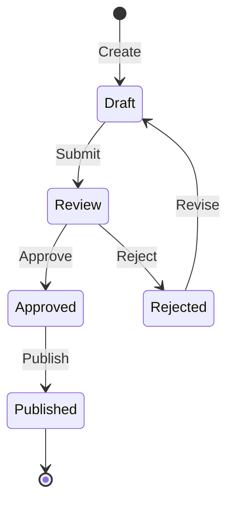
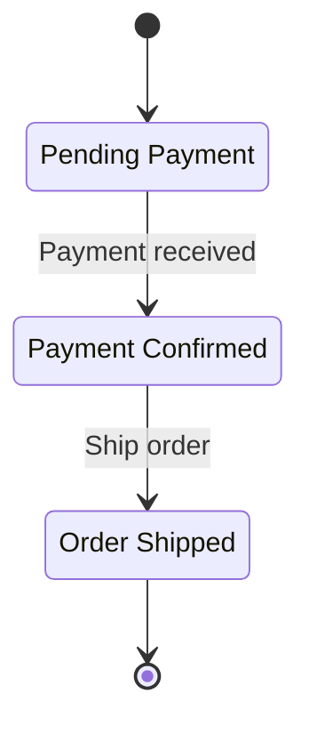
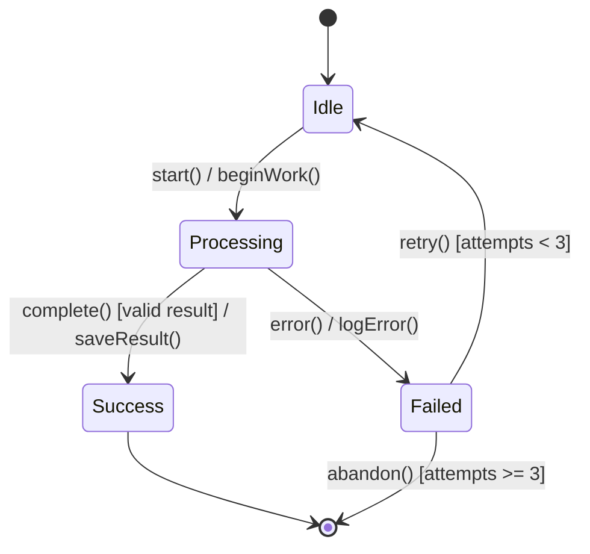
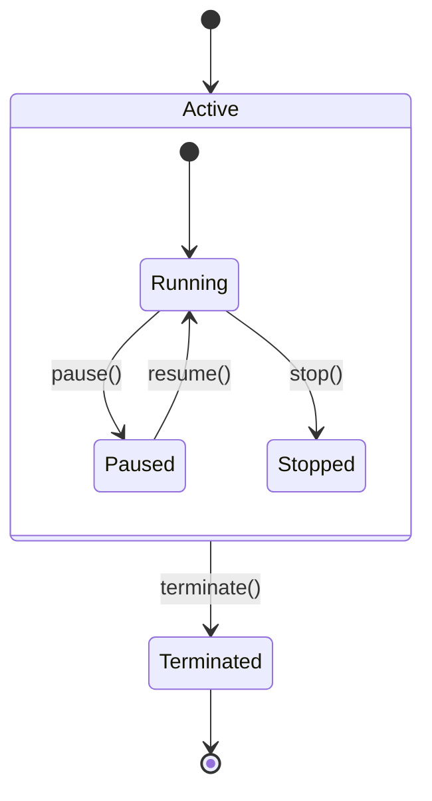
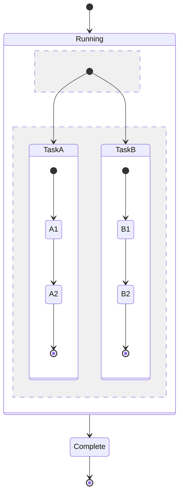
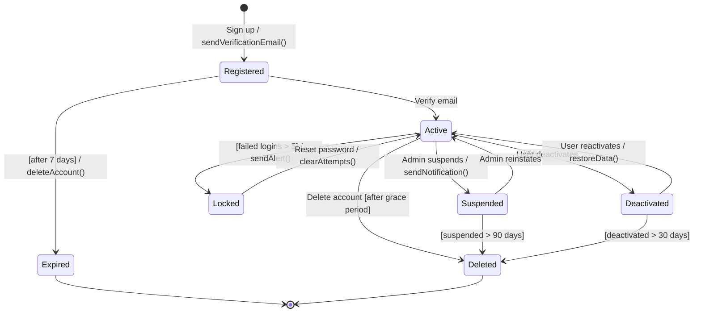
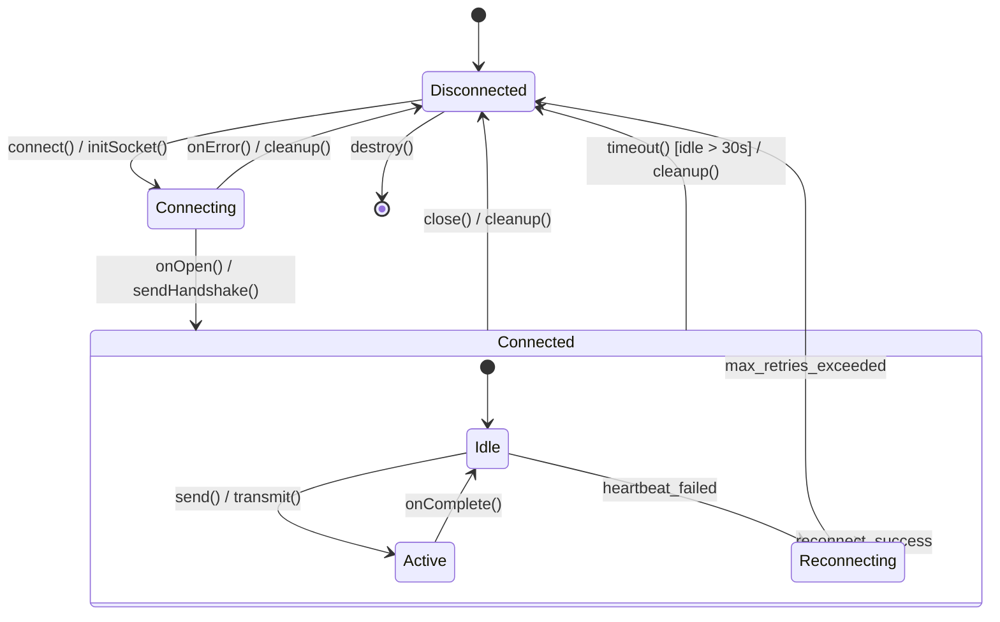
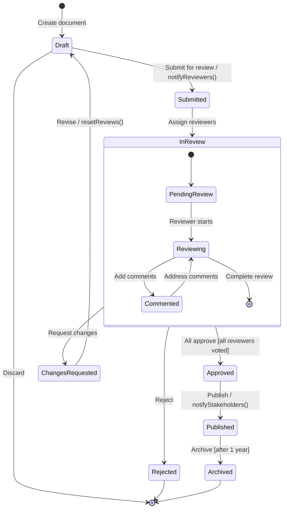

# UML State Diagram Skill

This skill generates UML state diagrams using Mermaid to document entity lifecycles, workflow states, and stateful behavior in systems.

## Purpose

Visualize state machines showing:
- **States:** Distinct modes or conditions an entity can be in
- **Transitions:** Events that trigger state changes
- **Guards:** Conditions that control transitions
- **Actions:** Activities performed during transitions or within states
- **Composite states:** Hierarchical or parallel states

## Instructions

When this skill is invoked:

1. **Identify the entity:**
   - Business entity (Order, User, Payment)
   - Workflow (Approval, Deployment, Review)
   - System component (Connection, Session, Cache)
   - Process (Build, Migration, Sync)

2. **Map states:**
   - Initial state (starting point)
   - Active states (normal operation)
   - Terminal states (end points)
   - Error/failure states

3. **Define transitions:**
   - Triggering events (user actions, system events)
   - Guard conditions (when transition allowed)
   - Actions performed (side effects, notifications)

4. **Generate Mermaid state diagram:**
   - Use clear state names
   - Label transitions with events
   - Add conditions and actions
   - Show composite states if needed

5. **Provide placement guidance:**
   - Section 6.2: Lifecycle/stateful behavior
   - Section 8.1: Domain concepts (business entities)

## Mermaid State Diagram Syntax

### Basic Structure



### States with Descriptions



### Transitions with Conditions and Actions



**Notation:**
- `event()` - Trigger
- `[condition]` - Guard
- `/ action()` - Effect

### Composite States (Nested)



### Parallel States (Concurrent)



### State Entry/Exit Actions

```mermaid
stateDiagram-v2
    state Processing {
        [*] --> Working
        Working --> [*]
    }

    note left of Processing
        entry / startTimer()
        exit / stopTimer()
    end

    [*] --> Processing
    Processing --> [*]
```

## Common Patterns

### 1. Order Lifecycle

```mermaid
stateDiagram-v2
    [*] --> Pending: Order created

    Pending --> Confirmed: Payment received
    Pending --> Cancelled: User cancels / refund()

    Confirmed --> Processing: Start fulfillment
    Confirmed --> Cancelled: Out of stock / refund()

    Processing --> Shipped: Package dispatched / sendTracking()
    Processing --> Failed: Shipping error / notifyUser()

    Shipped --> Delivered: Confirmed arrival
    Shipped --> InTransit: In transit

    InTransit --> Delivered: Confirmed arrival
    InTransit --> Returned: Return initiated

    Delivered --> Completed: [after 14 days]
    Returned --> Refunded: Process return / issueRefund()

    Failed --> Pending: Retry order
    Failed --> Cancelled: Unable to fulfill / refund()

    Cancelled --> [*]
    Completed --> [*]
    Refunded --> [*]

    note right of Confirmed
        entry / reserveInventory()
        exit / releaseInventory()
    end
```

### 2. User Account States



### 3. Payment Processing

```mermaid
stateDiagram-v2
    [*] --> Initiated: Start payment

    Initiated --> Authorizing: Authorize card
    Authorizing --> Authorized: Authorization success
    Authorizing --> Failed: Authorization failed / notifyUser()

    Authorized --> Capturing: Capture funds
    Capturing --> Captured: Capture success / updateOrder()
    Capturing --> Failed: Capture failed / releaseAuth()

    Authorized --> Voided: Cancel order [within 7 days] / voidAuth()

    Captured --> PartialRefund: Partial refund / processRefund()
    Captured --> FullRefund: Full refund / processRefund()

    PartialRefund --> Captured: [balance > 0]
    PartialRefund --> FullRefund: [balance = 0]

    Failed --> [*]
    Voided --> [*]
    FullRefund --> [*]

    note right of Captured
        entry / sendReceipt()
        exit / logTransaction()
    end
```

### 4. Build Pipeline

```mermaid
stateDiagram-v2
    [*] --> Queued: Push commit / triggerBuild()

    Queued --> Building: Allocate runner
    Building --> Testing: Build success
    Building --> Failed: Build error / notifyDev()

    Testing --> Deploying: Tests pass
    Testing --> Failed: Tests fail / notifyDev()

    Deploying --> Success: Deploy complete / notifyTeam()
    Deploying --> Failed: Deploy error / rollback()

    Failed --> Queued: Retry [manual]
    Success --> [*]
    Failed --> [*]: Abandon [after 3 retries]

    note right of Building
        entry / pullDependencies()
        do / compile()
        exit / publishArtifacts()
    end
```

### 5. Connection State Machine



### 6. Approval Workflow



## Best Practices

### State Naming
- **Use nouns or adjectives:** "Pending", "Active", "Processing"
- **Be specific:** "PaymentAuthorized" not "Step2"
- **Consistent tense:** Past participle or present ("Completed" or "Complete")
- **Avoid verbs:** States are conditions, not actions

### Transition Naming
- **Use verb phrases:** "Submit order", "Approve request"
- **Show events:** "Payment received", "Timeout occurred"
- **Include guards:** `[condition]` for when transition is allowed
- **Include actions:** `/ action()` for side effects

### Complexity Management
- **Limit states:** 5-12 states for readability
- **Use composite states:** Group related states
- **Parallel states:** Show independent concurrent states
- **Multiple diagrams:** Break complex workflows into separate diagrams

### Documentation
- **Add notes:** Explain entry/exit actions
- **Show invariants:** What's true in each state
- **Document guards:** When transitions are allowed
- **Indicate timing:** Timeouts, delays, durations

## Placement in arc42 Documentation

| Use Case | Section | Purpose |
|----------|---------|---------|
| Business entity lifecycle | 8.1 Domain & Data Concepts | Order, Payment, User states |
| Workflow/process | 6.2 Failure/Degraded Scenario | Approval, deployment, review flows |
| System component | 6.2 Runtime View | Connection, session, cache states |
| Technical behavior | 5.3 Components | Service, worker, agent states |

## Usage Examples

**Example 1: E-commerce order lifecycle**
```
User: State diagram for order lifecycle from creation to delivery
Skill: [Generates diagram with Pending, Confirmed, Shipped, Delivered states plus error paths]
```

**Example 2: User authentication states**
```
User: Show user account states including locked, suspended, and deleted
Skill: [Creates diagram with transitions for login failures, admin actions, deactivation]
```

**Example 3: CI/CD pipeline states**
```
User: Build pipeline states from commit to deployment
Skill: [Illustrates Queued, Building, Testing, Deploying, Success/Failed states]
```

**Example 4: Saga workflow**
```
User: State machine for distributed saga with compensations
Skill: [Shows normal flow plus compensation states for rollback]
```

## State Machine Types

### Simple State Machine
- Flat structure
- No nested states
- Clear transitions
- Use for: Simple lifecycles (3-5 states)

### Hierarchical State Machine
- Composite states
- State nesting
- Shared transitions
- Use for: Complex workflows (6+ states with groups)

### Concurrent State Machine
- Parallel states
- Independent regions
- Separate lifecycles
- Use for: Multi-aspect entities (status + approval + payment)

## Error Handling

- If entity unclear: Ask what's being modeled (order, user, process)
- If states unclear: Request list of possible conditions
- If transitions complex: Suggest breaking into multiple diagrams
- If timing matters: Add notes about timeouts and durations

## Output Format

Always provide:
1. Complete Mermaid state diagram code block
2. Description of what entity/workflow is modeled
3. List of states with meanings
4. Key transitions and their triggers
5. Guards and actions explained
6. Recommended placement in arc42 Section 6 or 8
7. Related diagrams to consider (sequence diagram for flows)

## Cross-References

- **Sequence diagrams (sequence-diagram skill):** Show interactions that trigger state transitions
- **API documentation (api-draft skill):** APIs that trigger state changes
- **MongoDB schemas (mongodb-schema skill):** Persist state in database
- **ADRs (create-adr skill):** Document state machine design decisions
